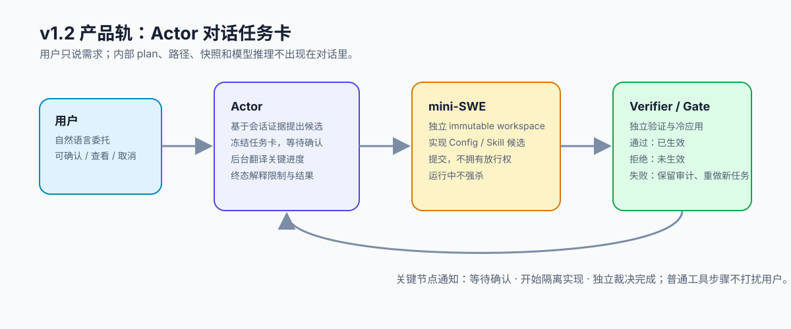

<div align="center">
  <h1>Loom · 织机</h1>

  <p><strong>给 DeepSeek Harness 装上一套可验证的演进层。</strong></p>
  <p>让 Skill 不再只是“装进去就不动”：从你的任务、纠正与失败中生成个性化候选，隔离实现，独立验证，通过后才安装。</p>

  <p>
    <a href="#三分钟开始"><strong>三分钟开始</strong></a>
    ·
    <a href="docs/README-detailed.md"><strong>完整手册</strong></a>
    ·
    <a href="docs/evidence/v1.2.33.md"><strong>查看证据</strong></a>
  </p>

  <p>
    <a href="https://www.npmjs.com/package/dsh-loom"></a>
    <a href="https://github.com/ZTCNO0NE/dsh-loom/releases"></a>
    
    <a href="LICENSE"></a>
  </p>
</div>



---

## 你的 Harness 会用工具，但它会按你的方式成长吗？

普通插件负责“把能力装进去”。Loom 负责能力装进去之后的另一半：**发现哪里不适合你、提出怎样调整、证明改动没有破坏旧能力，以及改坏后如何恢复。**

你可以直接对 Actor 说：

> “给我加一个失败后先做证据复盘的 Skill。”

目标已经明确时，Actor 会直接展示目标、风险和验收方式。你确认后，mini-SWE 才在隔离 workspace 实现；Verifier/Gate 独立决定它能否进入真实 Harness。用户不需要知道 `planId`、文件路径或内部工具名。

如果你描述的是“最近变慢了”“回答不够聪明”这类症状，Actor 不会自己猜成 Config 或 Skill。它会把冻结证据交给只读 Builder：Builder 只能阅读、溯因和提出 1–3 个 `Config / Skill / Loop / 暂不修改` 方向，不能编辑、运行命令、提交或安装。Actor 负责把差异解释给你；你选择以后，系统才创建一条新的 immutable implementation plan。Config 的最终目标仍只能从宿主真实存在、可编辑且不含凭据的配置项中确认，Builder 不能替宿主发明 target。

```text
用户需求
   ↓
Actor 分诊：明确目标 ───────────────┐
   │ 模糊 / 跨层 / Loop / 前次失败 │
   ↓                               │
Builder 只读方向诊断 → Actor 解释 → 用户选择
                                   ↓
                              Plan 任务卡
   ↓  用户确认
mini-SWE 隔离实现
   ↓
Verifier 独立核验
   ↓
Gate 安装 / 拒绝 / 回滚
```

## 一个插件，一套演进栈

`dsh-loom` 不是单一 Skill，而是一个 DSH bundle。安装一次，它把演进所需的控制面拼成一条链：

| 组件 | 它替你做什么 |
| --- | --- |
| Actor gateway | 接住自然语言需求并分诊；明确目标直接 Plan，模糊问题转 Builder 只读诊断 |
| Builder diagnosis | 从冻结证据提出跨 Config/Skill/Loop/no-change 的方向，不接触实现与放行 |
| Evidence pack | 冻结用户原话、会话事实、before snapshot 与失败反馈 |
| mini-SWE runtime | 在隔离 workspace 读取、编辑、测试并提交候选 |
| Verifier | 用固定检查、cold replay 和契约判断是否通过 |
| Gate | 持有最终安装权，记录 receipt，失败时恢复 before snapshot |
| Skill provider | 让 Gate 安装的新 Skill 被后续 Actor 会话真实发现 |

所以它可以被称为 **Harness Evolution Distribution（Agent 演进整合包）**：一个插件交付 Builder、证据、验证、安装和回滚，不让用户自己拼五套系统。

它目前还不是通用包管理器。Loom 已管理 Skill/Config 的受控生命周期，但开放仓库、SemVer 依赖求解、签名来源、同名 Skill 原位升级和多包原子事务仍在路线图中。今天可靠交付的是：**明确委托的新 Skill bundle 与既有 Config 行演进**。

## 它能带来什么

### 1. 把你的纠正变成个性化能力

同一个通用 Skill，不同团队会有不同约束：有人要求修改后跑最小测试，有人要求先输出证据，有人禁止未经确认触碰生产。Loom 可以把这些真实纠正交给 Builder，形成新的个性化 Skill 候选，而不是永远停留在聊天记忆里。

### 2. 能生成，也必须能证明

Builder 有探索与实现空间，但没有放行权。成功必须经过独立 Verifier/Gate；一个 workspace 里“看起来写好了”的文件，不等于已经提交，更不等于已经安装。

### 3. 演进不会堵住当前对话

任务在后台以 immutable run 执行。Actor 只在等待确认、开始、裁决和失败等关键节点通知用户；普通工具步骤不会刷屏。

### 4. 改动有历史，也有退路

每次演进保留用户目标、证据、before/after、模型轨迹、Verifier verdict 和 Gate receipt。失败不会被删除，重做会创建新的 run，旧记录保持只读。

## 三分钟开始

前提：DeepSeek Harness 已能运行；Node `^22.19` 或 `>=24`；Python `>=3.10`。在 DSH Settings/Models 或 `$DSH_HOME/.credentials.yaml` 配置 `DEEPSEEK_API_KEY`，Builder 默认复用这一份凭据，不需要把 key 发进对话。

### 1. 安装并检查 bundle

```bash
pnpm dsh plugin --profile web add dsh-loom@1.2.33
pnpm dsh web --dump-config
```

输出中应包含 `meta-validate`。

### 2. 安装隔离实现 runtime

<details>
<summary><strong>Windows · PowerShell</strong></summary>

```powershell
$env:DSH_META_VALIDATE_ROOT = "$env:USERPROFILE\.dsh\meta-validate"
$runtimeRoot = Join-Path $env:USERPROFILE ".dsh\meta-validate\runtime\mini-swe-agent-2.4.6"

powershell -ExecutionPolicy Bypass `
  -File "$env:USERPROFILE\.dsh\profiles\web\node_modules\dsh-loom\bin\setup-windows.ps1" `
  --runtime-root $runtimeRoot

$patch = Join-Path $runtimeRoot "loom-active-evolution.patch.yml"
pnpm dsh web --patch $patch
```

</details>

<details>
<summary><strong>macOS / Linux · shell</strong></summary>

```bash
export DSH_META_VALIDATE_ROOT="$HOME/.dsh/meta-validate"
runtime_root="$HOME/.dsh/meta-validate/runtime/mini-swe-agent-2.4.6"

sh "$HOME/.dsh/profiles/web/node_modules/dsh-loom/bin/setup-unix.sh" \
  --runtime-root "$runtime_root"

pnpm dsh web --patch "$runtime_root/loom-active-evolution.patch.yml"
```

</details>

保持 Web 进程运行，打开 [http://localhost:3080](http://localhost:3080)。

### 3. 用自然语言发起第一次演进

```text
你：给我加一个复盘失败的技能，先展示计划，不要直接安装。
Actor：展示候选方向、风险、证据与验收方式。

你：确认执行。
Actor：后台隔离实现 → Verifier/Gate 裁决 → 告知已生效或未生效。

你：演进进度怎么样？
Actor：返回当前任务卡，不暴露凭据、绝对路径或隐藏推理。

你：给我看这次用了哪些证据。／我之前有哪些演进任务？
Actor：返回冻结证据的脱敏索引，或最近任务的结果历史；不返回原始转录、内部 ID 和隐藏推理。
```

Windows 源码 checkout、Python、host fallback、凭据覆盖和取消/重做的完整说明见[详细快速开始](docs/README-detailed.md#快速开始从零启动-dsh到第一次任务卡)。

## 已有证据，不靠一句“它变强了”

| 验收项 | 当前结果 |
| --- | --- |
| 工程回归 | **275/275** |
| Windows 独立 Skill 演进 | **6/6** 完成 `submit → verify → gate → cold-load` |
| 动态 runtime profile | 5–6 回合主动提交，0 环境探查、0 非零工具结果 |
| 正式包冷启动 | Windows registry 安装，Web HTTP 200 |
| 安全边界 | Builder 不能修改 Verifier/Gate，也不能自我批准 |

Actor + Builder 双平台真实链路、原始轨迹边界和发布门见 [v1.2.33 release evidence](docs/evidence/v1.2.33.md)；mini-SWE 的 6/6 Windows Skill 稳定性数据仍见 [v1.2.32 release evidence](docs/evidence/v1.2.32.md)。这些数据证明受测链路，不宣称任意模型、任意 Skill 或复杂源码重构必然成功。

## 产品范围与研究方向

| 状态 | 能力 |
| --- | --- |
| v1.2 产品能力 | 用户主动委托 Config / 新 Skill 演进；Plan/Execute；任务卡；独立裁决；cold replay / rollback |
| 实验能力 | Actor Loop 复杂源码重构、固定矩阵成功率、prepare-overlap 性能工作负载 |
| 下一阶段 | 已安装 Skill 的版本化个性调整、Skill 依赖/冲突、来源签名、组合事务、团队 Skill catalog |
| 不做虚假承诺 | 无人工长期自治、任意复杂重构稳定成功、Actor 整体性能提升 |

长期方向不是让 Loom 垄断所有插件，而是让它成为**统一演进控制面**：插件仍由开放生态提供；Loom 管理“为什么改、改哪一个、如何验证、何时安装、如何回滚”。

## 文档

| 入口 | 内容 |
| --- | --- |
| [完整手册](docs/README-detailed.md) | 原 README 的全部案例、图解、系统安装与诚实边界 |
| [使用指南](docs/USAGE.md) | 工具与运行方式 |
| [架构](docs/architecture.md) | Actor / Builder / Verifier / Gate 与 TCB |
| [插件组合规范](docs/plugin-composition-spec.md) | capability、verifier、gate 的解耦方式 |
| [Builder 基础规范](docs/builder-foundation-spec.md) | 极简 Kernel、能力插件与持久微循环 |
| [研究日志](docs/research/run-log.md) | 成功与失败实验的追加式记录 |

## License

[MIT](LICENSE)
