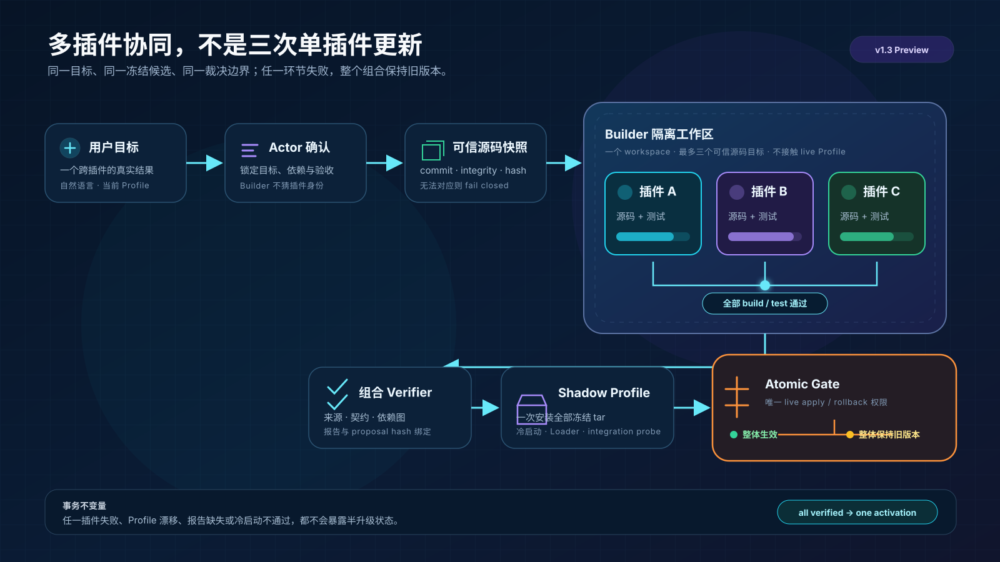
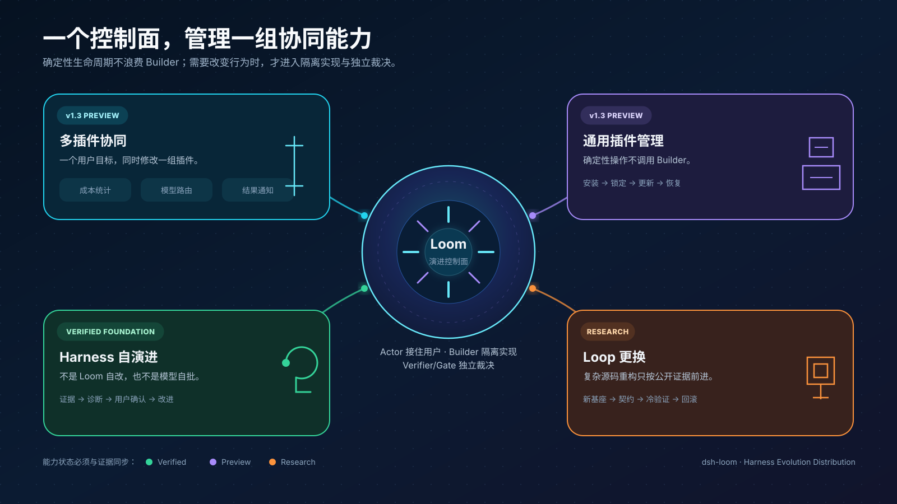

<div align="center">
  <h1>Loom · 织机</h1>

  <p><strong>让你的 Harness，不只会装插件，还会把插件组合演进成真正适合你的系统。</strong></p>
  <p>面向 DeepSeek Harness 的可验证演进控制面：Actor 专注当前任务，Builder 在隔离环境协同修改，Verifier/Gate 决定能否整体生效。</p>

  <p>
    
    
    <a href="#三分钟开始"><strong>三分钟开始</strong></a>
    ·
    <a href="docs/README-detailed.md"><strong>完整手册</strong></a>
    ·
    <a href="docs/evidence/v1.2.33.md"><strong>真实证据</strong></a>
  </p>

  <p>
    <a href="https://www.npmjs.com/package/dsh-loom"></a>
    <a href="https://github.com/ZTCNO0NE/dsh-loom/releases"></a>
    
    <a href="LICENSE"></a>
  </p>
</div>

<!-- QWEN_IMAGE_01: 验收通过后在此插入 docs/figures/fig-v13-plugin-loom-hero.png。生成与验收规格见 docs/visuals/v1.3-readme/。 -->

> **当前版本边界**：v1.2.33 已发布的是自然语言委托、Config/新 Skill 演进、只读 Builder 诊断和独立 Verifier/Gate。多插件源码协同、通用插件生命周期与原子组合激活是 **v1.3 Preview**；复杂 Loop 更换继续以 **Research** 方式公开证据和失败。

---

## 一个插件能工作，不代表一组插件能共同完成你的目标

真实 Harness 很少只靠一个插件。成本统计要把信号交给模型路由，模型路由的决定要进入结果通知；测试执行、Git 安全与交付报告也必须共享同一套团队约束。

普通包管理器能回答“安装哪个版本”。Loom 还要回答：

- 为什么要改这一组插件；
- 多个源码候选是否来自可信版本；
- 它们组合后能否启动并满足同一个目标；
- 其中一个失败时，怎样避免暴露半升级状态；
- 改坏后如何整体回到原组合。

这就是 v1.3 的主线：**把插件组合当作一个可验证、可恢复的演进事务，而不是连续执行几次单包更新。**



## 为什么不把所有演进规则塞进 Actor

Actor 的上下文首先应该服务当前用户任务，而不是常驻一整套源码探索、验证协议、历史轨迹和回滚规则。

Loom 把两种状态分开：

| Actor 当前工作集 | Loom 外部持久状态 |
| --- | --- |
| 用户当前目标 | immutable plan 与 source snapshot |
| 当前任务需要的工具结果 | Builder workspace 与测试结果 |
| 需要向用户解释的进度 | Verifier reports 与 Gate receipts |
| 本轮必要摘要 | 历史版本、失败轨迹与恢复依据 |

两者只在提出候选、等待确认、裁决完成和失败等关键节点交换摘要。这里的“上下文更干净”不是删除记忆，而是**把长期事实放在可恢复的外部状态中，按需装载**。

<!-- QWEN_IMAGE_03: 验收通过后在此插入 docs/figures/fig-v13-context-separation.png。文字白名单与验收表见 docs/visuals/v1.3-readme/。 -->

## 一个控制面，四个方向



### 1. 成本感知的模型调度 `v1.3 Preview`

> “当本轮预计成本超过 2 美元时，切换便宜模型，并在结束后告诉我节省了多少。”

这不是只改一个阈值。Loom 需要让成本统计、模型路由和结果通知围绕同一个验收目标协同更新；三个候选全部通过，组合才进入冷激活。

### 2. 团队代码交付链 `v1.3 Preview`

> “修改后必须先跑聚焦测试；失败要保留日志；不要把整套规则一直塞进任务 prompt。”

测试执行、Git 安全和结果报告插件共同承载这条团队规则。Actor 只获得当前任务必要的动作与结果，治理细节留在 Loom 的持久控制面。

### 3. Harness 自演进 `Verified Foundation / v1.3 Preview`

> “最近复杂任务总在提交前耗尽回合，找出是哪一层的问题，再让我决定怎么改。”

v1.2.33 已证明 Actor 可以把模糊症状交给只读 Builder 诊断，再由用户选择 Config、Skill、Loop 或暂不修改。v1.3 将把已安装插件及其组合加入可选目标。

这里的自演进指 **Harness 演进受控插件、Config 和 Loop**；不允许 Loom、Verifier 或 Gate 修改自己并批准自己。

### 4. 更换 Agent Loop 基座 `Research`

> “当前调度 Loop 处理不好并行 prepare、exclusive 和 abort，换一个更强的基座。”

Loop 候选必须经过源码构建、required tests、C0–C8 契约、cold profile、同任务 replay 与 rollback。已有受控闭环不等于任意复杂重构已经稳定；成功与失败都进入固定研究记录。

## v1.3：通用插件包管理器，也是演进的部署底座

确定性生命周期操作不需要浪费 Builder 回合：

| 用户动作 | 执行方式 |
| --- | --- |
| 查看当前 Profile 插件 | 读取 DSH Plugin Inventory |
| 安装 npm 包或本地 tgz | 冻结精确版本与 integrity，复用 DSH/pnpm |
| 更新、移除 | 先展示目标版本和影响，再执行确定性事务 |
| 恢复上一版本 | 从 Gate receipt 创建新的恢复事务 |
| 改变插件行为或协同关系 | 才进入 Builder 隔离源码实现 |

Loom 不重造 registry、SemVer solver 或另一套 Dashboard。它使用 DSH 已有插件平台，把来源、协同验证、原子激活和恢复补成一条完整链。

## 它怎样保持开放，又不让模型自己当裁判

```text
用户需求
   ↓
Actor：解析当前插件组合、提出候选、解释风险
   ↓ 用户确认
Builder / mini-SWE：在可信源码副本中实现与测试
   ↓ immutable proposal + frozen artifacts
Verifier：来源、diff、build、契约、组合、cold profile
   ↓ all passed
Gate：整体激活 / 保持旧版本 / 记录恢复 receipt
```

- Builder 可以探索和实现，但不能选择 live 目标、扩展事务范围或放行自己；
- Verifier 读取冻结候选，不接受 Builder 临时改写的验收规则；
- Gate 是唯一安装与恢复权限持有者；
- `dsh-loom`、DSH、凭据、Verifier/Gate 始终不属于普通演进目标。

## 已有证据，不靠一句“它变强了”


| 能力 | 状态 | 证据 |
| --- | --- | --- |
| Actor 自然语言 Plan/Execute 与持久任务卡 | **Verified** | [v1.2.33 release evidence](docs/evidence/v1.2.33.md) |
| Config/新 Skill 隔离实现与独立裁决 | **Verified** | Linux/Windows cold E2E 与既有 release records |
| Builder 只读方向诊断 | **Verified** | Linux 真模型运行、Windows 3/3、无 workspace/proposal/submission |
| 工程回归 | **Verified** | **288/288** |
| 多插件源码协同与原子 Profile 激活 | **v1.3 Preview** | 完成双平台事务 E2E 后才升级状态 |
| 通用插件安装、更新、移除与恢复 | **v1.3 Preview** | 完成生命周期 E2E 后才升级状态 |
| 复杂 Loop 基座更换 | **Research** | 只按公开 contract/workload/raw records 描述 |

这些证据证明受测链路，不证明任意模型、任意插件源码或复杂 Loop 重构必然成功。

## 三分钟开始

前提：DeepSeek Harness 已能运行；Node `^22.19` 或 `>=24`；Python `>=3.10`。在 DSH Settings/Models 或 `$DSH_HOME/.credentials.yaml` 配置 `DEEPSEEK_API_KEY`，Builder 默认复用这份凭据，不需要把 key 发进对话。

### 1. 安装并检查 Loom

```bash
pnpm dsh plugin --profile web add dsh-loom@1.2.33
pnpm dsh web --dump-config
```

输出中应包含 `meta-validate`。

### 2. 安装隔离实现 runtime

<details>
<summary><strong>Windows · PowerShell</strong></summary>

```powershell
$env:DSH_META_VALIDATE_ROOT = "$env:USERPROFILE\.dsh\meta-validate"
$runtimeRoot = Join-Path $env:USERPROFILE ".dsh\meta-validate\runtime\mini-swe-agent-2.4.6"

powershell -ExecutionPolicy Bypass `
  -File "$env:USERPROFILE\.dsh\profiles\web\node_modules\dsh-loom\bin\setup-windows.ps1" `
  --runtime-root $runtimeRoot

$patch = Join-Path $runtimeRoot "loom-active-evolution.patch.yml"
pnpm dsh web --patch $patch
```

</details>

<details>
<summary><strong>macOS / Linux · shell</strong></summary>

```bash
export DSH_META_VALIDATE_ROOT="$HOME/.dsh/meta-validate"
runtime_root="$HOME/.dsh/meta-validate/runtime/mini-swe-agent-2.4.6"

sh "$HOME/.dsh/profiles/web/node_modules/dsh-loom/bin/setup-unix.sh" \
  --runtime-root "$runtime_root"

pnpm dsh web --patch "$runtime_root/loom-active-evolution.patch.yml"
```

</details>

保持 Web 进程运行，打开 [http://localhost:3080](http://localhost:3080)。

### 3. 用自然语言提出第一次演进

```text
你：给我加一个发布前检查配置的技能，先展示计划，不要直接安装。
Actor：展示目标、风险、证据和验收方式。

你：确认执行。
Actor：后台隔离实现 → Verifier/Gate 裁决 → 返回已生效或未生效。

你：演进进度怎么样？
Actor：返回当前任务卡，不暴露凭据、绝对路径或隐藏推理。
```

v1.3 多插件对话示例是 Preview，尚不能用上述稳定版本执行。Windows 源码 checkout、凭据覆盖、取消与重做见[详细快速开始](docs/README-detailed.md#快速开始从零启动-dsh到第一次任务卡)。

## 路线与边界

| 层级 | 能力 |
| --- | --- |
| 现在可用 | Config、新 Skill、Plan/Execute、任务卡、Builder 方向诊断、Verifier/Gate |
| v1.3 Preview | 可信插件源码、最多三个插件协同修改、通用生命周期、原子组合激活与恢复 |
| Research | 复杂 Loop、长期自治、固定矩阵成功率与性能 workload |
| 明确不做 | 自动 npm publish、无来源修改、Builder 自批、自改 Loom/Verifier/Gate、用单 patch Gate 假装组合原子 |

长期方向不是让 Loom 垄断插件生态，而是让开放插件拥有统一的演进控制面：**为什么改、哪些插件一起改、如何证明、何时生效、如何恢复。**

## 文档

| 入口 | 内容 |
| --- | --- |
| [完整手册](docs/README-detailed.md) | 安装、历史案例、架构、实验与边界 |
| [使用指南](docs/USAGE.md) | 工具与运行方式 |
| [v1.3 视觉交接](docs/visuals/v1.3-readme/README.md) | Qwen2 prompts、候选验收和 SVG 资产 |
| [插件组合规范](docs/plugin-composition-spec.md) | capability、verifier、gate 的解耦方式 |
| [Builder 基础规范](docs/builder-foundation-spec.md) | 极简 Kernel、能力插件与持久状态 |
| [研究日志](docs/research/run-log.md) | 成功与失败实验的追加式记录 |

## License

[MIT](LICENSE)
