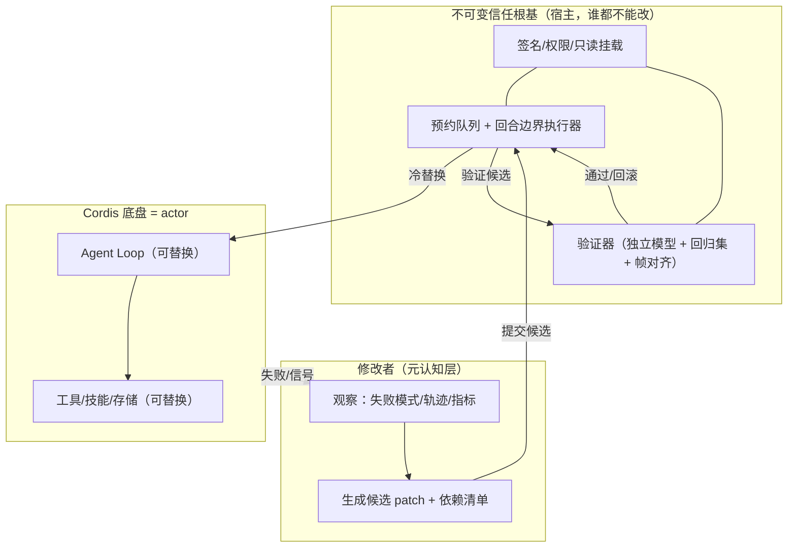

# Agent 怎么安全地改自己？

一个给 **DeepSeek Harness** 的“第二个验证器”插件：让 agent 在**不能热替换自己**的前提下，完成真正的运行时自进化——`observe → propose → validate → cold-apply → rollback`。

> off 0/3 → on 5/5：一个从零开始的 agent，在真实模型驱动下自己长出了 fs-write、ls-dir、bash-run、file-read 工具和 edit-verify、json-verify 技能。严格同任务集对照：**Δsuccess +3**，测试 **69/69** 全绿。


## 一分钟读懂

agent 不能在自己运行的循环里替换自己运行的循环，这是自指困境。所以所有修改都走：

1. **观察（observer）**：采集失败信号——连续失败、用户纠正、回归失败、可复用战术。
2. **迭代（builder）**：独立模型生成候选 patch + 依赖清单 + **预期轨迹**。
3. **核验（verifier）**：候选在隔离环境真实执行，预期轨迹与真实帧**逐字段/哈希完全对齐**，不通过强制回炉。
4. **冷替换（gate）**：预约队列 + 回合边界停机 + 原子切换 + 冒烟验证 + 失败回滚。
5. **回滚**：任何应用前记录 before/after 快照，改错了自动还原。


## 为什么冷替换是唯一安全路径

agent 在自己运行的 loop 里改自己的 loop，等于自己给自己当裁判：改了验证器，自进化就退化成自我欺骗。参照 prime-agent 的 refine 管线，我们只学它的**冷替换/回滚机制**：修改必须经过 loop 外部的执行者，在回合边界停机、原子切换、失败还原。


## 为什么验证必须独立

验证参考 **Tycho**（ARC-AGI-3 求解 agent，arXiv:2607.28287）：验证不做主观审查，而是把世界模型仿真预测与真实帧做**确定性完全对齐**——逐转移、逐格、逐字段/哈希比对，第一次分歧即判失败。模型在真实 no-op 上凭空预测变化也算错，防止发明规则蒙混过关。

映射到本插件：

- **独立模型实例**：builder 与 actor 不共享模型实例、会话状态、提示词历史。
- **固定式完整核验**：verdict 只由确定性对齐 + 回归集 + 配置不变性决定，LLM 不进判定。
- **TCB 信任根基**：验证器、回归集、签名公钥所在路径对 actor 只读；被修改的 actor 永远够不到验证链路。

## 四个组件



| 组件 | 职责 | 关键约束 |
| --- | --- | --- |
| observer | 采集信号，三层触发 | 信号持久化 signals.jsonl，不依赖模型自觉 |
| builder | 生成候选 patch + 预期轨迹 | 独立角色，输出默认不可信，自带世界模型文件 |
| verifier | 隔离执行 + 帧对齐 + 回归集 | 固定式完整验证，LLM 不进 verdict |
| gate | 预约 → 冷替换 → 冒烟 → 回滚 | 信任根基，actor 不可写 |

## 硬核证据


| 证据 | 数值 | 说明 |
| --- | --- | --- |
| 单元测试 | **69/69 全绿** | `npm test` |
| 从零基线 | **off 0/3** | bare actor 写文件/列目录/编辑验证全失败 |
| 从零成长 | **L1-L5 全过** | fs-write、ls-dir、bash-run、file-read + edit-verify、json-verify |
| 严格同任务集 | **off 0/3 → on 3/3** | Δsuccess +3，回归不降 |
| 宿主内闭环 | **pass=true** | dsh 内 27b 调 meta.auto → verifier approved → gate applied |
| 真实模型回炉 | **2 轮迭代后 approved** | builder = DeepSeek V4 Flash |
| 成本计量 | builder ~974 in / 4681 out | cost-log.jsonl 留痕 |
| 自建冒烟 | **5/5** | 官方 V4 Flash |

## 快速开始

```bash
npm install
npm run check
npm run build
npm test                       # 69/69
dsh plugin --profile demo add ./dsh-meta-validate
dsh --profile demo --dump-config   # 确认组合树
```

验收命令：

```bash
npm run fromzero:verify        # L1-L5 已安装态全任务
npm run fromzero:compare       # 严格 Δsuccess
npm run host-demo              # 宿主内自进化闭环 pass=true
```

## 设计边界（诚实声明）

- 第一版只允许改 `config | tool | skill`，**loop 层不放**——这是设计项，不是缺陷。
- verifier 是准入门槛，**上线后真实运行 + observer 观察**才是最终裁判。
- 验证成本 = 一轮完整任务 token，用最小回归集控制。
- dsh v0.1 是 developer preview，接口会变；所有注入点收敛在 `src/index.ts`。

## 相关参考

- [DeepSeek Harness](https://github.com/deepseek-ai/deepseek-harness)
- [Tycho（ARC-AGI-3，arXiv 2607.28287）](https://arxiv.org/abs/2607.28287)
- [prime-agent](https://github.com/PrimeIntellect-ai/prime-agent)
