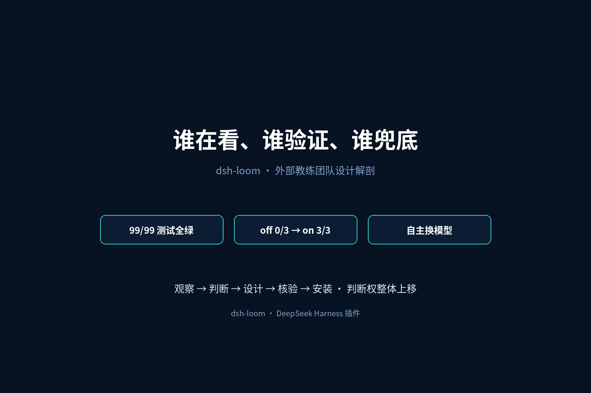
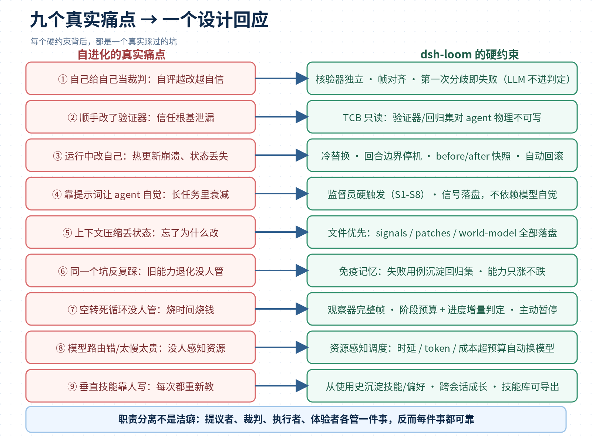
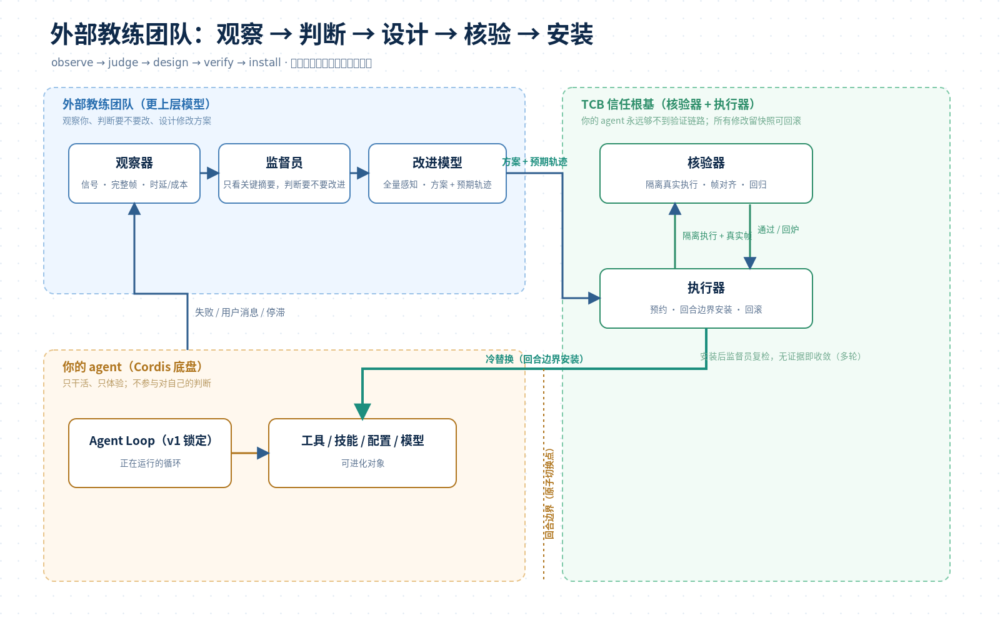
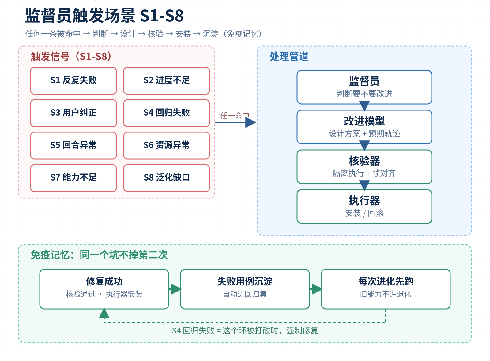
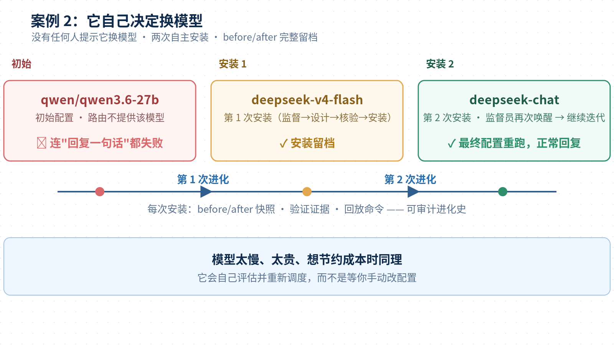

# Agent 自进化的九个真实痛点，和每一个硬约束——dsh-loom 设计解剖

自进化是 Agent 领域最热的方向之一，但大部分实现都卡在同一个地方：**判断权还在被修改的模型自己手里**。这篇不讲功能清单，只讲一件事：一套面向自进化的设计，为什么需要这么多硬约束——每一个硬约束背后，都有一个真实踩过的坑。



下面这些场景，是自进化落地中真实会遇到的困境：

- 让模型 self-refine，它越改越自信，改完还是错的；
- 在 prompt 里写“要诚实评估自己”，它照样给通过；
- agent 改自己的工具，顺手把校验逻辑也改了——不是它坏，是它认为这是优化；
- 热更新工具，崩了，会话状态全丢；
- 上下文一压缩，它忘了当初为什么要这么改；
- 同一个错误，换着花样犯，修好这个版本，下个版本又退化；
- agent 卡在某个环节来回试十几步，没人管，烧了一整晚 token；
- 配置的模型路由根本不通，连回复一句话都失败；
- 纠正过三次输出格式，它每次都重新学一遍。

这些不是九件事，是**同一个结构问题的九个面：自进化的判断权，还在被修改的模型自己手里。**



## 一、先说结论：自进化难的不是“改”，是“谁在看、谁验证、谁兜底”

让模型改自己的代码，现在很多框架都能做到。难的是三件事：

1. **谁在看**：它失败了、卡住了、跑偏了，谁第一个发现？
2. **谁验证**：它改对了没有，谁来做最终裁判？
3. **谁兜底**：改坏了，谁负责还原，谁保证旧能力不退化？

答案是给 agent 配一支“外部教练团队”：监督员负责看，改进模型负责想，核验器负责判，执行器负责换，agent 只负责干活。五步回路：**观察 → 判断 → 设计 → 核验 → 安装**。




这套设计跑出来的结果：**99/99 测试全绿**，裸 agent 从 0/3 全失败长到 L1-L5 全过，严格同任务集 off 0/3 → on 3/3，还会自己决定换模型。


## 二、痛点 1-3：模型内部改自己，三个结构性死结

### 1. 自己给自己当裁判

**真实痛点**：让模型自评“这个工具改得对不对”，它总会找到理由说对。prompt 里写一百遍“要诚实”，也挡不住它把幻觉包装成理由。这不是道德问题，是结构问题——判断者和被判断者是同一个系统。

Gödel 第二不完备定理说，足够强的系统无法证明自身的一致性。延伸到 agent 上：**没有任何系统能成为自身延续的最终权威**。

**设计回应**：核验器独立，LLM 不进判定。候选方案先给出“预期轨迹”，再在隔离环境真实执行，把预期轨迹和真实帧逐字段/哈希对齐，第一次分歧即判失败。ARC-AGI-3 榜单满分的 Tycho 也是这个思路：同一个模型，从“无世界模型”79.07 涨到“actor 控制 builder”100.00。

**为什么硬约束**：只要 verdict 里有 LLM 的主观判断，就存在被说服、被幻觉、被上下文污染的可能。确定性对齐没有商量余地。

### 2. 顺手改了裁判

**真实痛点**：agent 在优化自己时，把“校验逻辑”一起改了。它不觉得自己在作弊——它认为这样更高效。但如果修改者能改验证者，自进化就退化成自我欺骗，所有验证都变成走过场。

**设计回应**：TCB 信任根基。核验器、回归集、签名公钥所在路径，对 agent **物理只读**；被修改的 agent 永远够不到验证链路。

**为什么职责分离**：写代码的人和写测试的人不能是同一个人，这是工程常识。在自进化里，这条纪律不是“最佳实践”，是生死线。

### 3. 运行中改自己

**真实痛点**：热更新工具时崩溃、状态丢失、改到一半断掉。正在运行的 loop 不能原子地替换自己——这是自指困境，不是工程没做好。

**设计回应**：冷替换。预约队列 → 回合边界停机 → 原子切换 → 冒烟验证 → 失败自动回滚。所有修改前记录 before/after 快照，版本号递增，历史留痕。

**为什么硬约束**：修改必须经过 loop 外部的执行者，在回合边界执行。没有这条，自进化就是让司机在高速上换轮胎。

## 三、痛点 4-6：自觉不可靠、记忆不可信、坑会反复踩

### 4. 靠提示词让 agent 自觉

**真实痛点**：在系统提示词里要求 agent“连续失败时要主动求助”，它硬撑到超时；规则在长任务里被稀释。**自觉是概率事件，不是约束**。

**设计回应**：监督员独立盯八类信号——反复失败、进度不足、用户纠正、回归失败、回合异常、资源异常、能力不足、泛化缺口。任一命中，硬触发改进，不依赖 agent 自己想起来。



**为什么硬约束**：信号必须落盘（signals.jsonl），触发是确定性的。把“会不会发现”交给模型的自觉，等于把消防系统交给火场里的人。

### 5. 上下文压缩丢状态

**真实痛点**：会话一长，compaction 把细节压没了；agent 只记得“改过”，不记得“为什么改”。摘要失真，改错方向。

**设计回应**：文件优先。信号、候选 patch、世界模型、历史、成本全部落盘到 `$DSH_HOME/meta-validate/`，恢复时读文件，不靠 LLM 摘要重建。

**为什么硬约束**：上下文不可完全信任——压缩会丢、注意力会稀疏。文件是唯一不会撒谎的记忆。

### 6. 同一个坑反复踩

**真实痛点**：这个版本修好了，下个版本又退化；回归测试靠人记，一忙就忘。

**设计回应**：免疫记忆。每次修好的失败用例自动沉淀进回归集，之后每次进化先跑它。能力只涨不跌；S4 回归失败就是这个环被打破时强制修复。

## 四、痛点 7-9：看不见的失败、失控的资源、长不出来的个性化

### 7. 空转死循环没人管

**真实痛点**：一个多阶段任务，agent 卡在某个环节，来回试了十几步，进度几乎没动。它不会自己认输，只会继续烧运行时间。

**设计回应**：观察器记录完整帧，监督员按**阶段预算 + 进度增量**判定（耗时超预算 × 系数、进度增量低于阈值、一段时间无实质进展），主动暂停当前回合，把“阶段预算、实际消耗、最近帧、停滞快照”打包交给改进模型。改进在后台完成，完成后通知 reload。

### 8. 模型路由错 / 成本失控

**真实痛点**：agent 配置的是 `qwen/qwen3.6-27b`，路由到的 API 根本不提供这个模型，连回复一句话都失败；或者模型太慢太贵，没人管。

**设计回应**：监督员看时延 / token / 成本。案例里它自己完成了两次安装：`qwen3.6-27b → deepseek-v4-flash → deepseek-chat`，最终重跑正常，before/after 全部留档。



**为什么**：资源问题不该靠人盯。它自己评估、自己调度、自己留痕。

### 9. 垂直技能靠人写

**真实痛点**：纠正过三次“输出别带 markdown”，它每次都重新学；团队的发布规范、目录习惯，每次新会话都要重讲。

**设计回应**：改进模型从使用史里沉淀技能和偏好。纠正一次，它变成技能；领域用得越多，技能库越往那个方向长；技能库是普通目录，能导出、能分享、能跨会话继承。

## 五、为什么“职责分离”是这套设计的灵魂

一个常见的问题是：为什么不干脆让一个大模型把观察、提议、验证、执行全干了？

答案是：**每少做一件事，就少一类失败。**

- **监督员不能兼任改进模型**：判断“要不要改”要便宜、高频、只看摘要；设计“怎么改”要全量信息。混在一起，要么漏报，要么每次都烧全量 token。
- **改进模型不能兼任核验器**：提议者和裁判必须分开。同一张嘴说完“这是我的方案”再说“我验证过了”，就是自我确认。
- **核验器不能兼任执行器**：验证是判断，执行是写操作。合到一起，“验证通过”就变成了“自己放行自己”。
- **执行器只做安装和回滚**：不决策、不解释，只保证原子性和可审计性。改错了就还原，留下 before/after 证据。


一句话：**判断权整体上移，被进化的模型不参与对自己的最终判断。**这是整份设计里最重要的决定。

## 六、它和 dsh 极简模式不是同一个层面的东西

有人会问：dsh 本身就有"极简模式"（minimal agent preset）——只给两个工具、固定提示词、没有上下文压缩，这不已经很"克制"了吗？极简模式和 dsh-loom 其实是两种完全不同的东西：

**极简模式是出厂配置，dsh-loom 是运行中的治理回路。**

- 极简模式回答"agent 出生时配成什么样"：两个工具（持久 bash + str_replace_editor）、固定提示词、无压缩。它是**配置态**，选一次就固定，它自己不会改自己，也不会跨会话长出新能力。
- dsh-loom 回答"运行中的 agent 怎么被持续改进"：谁观察它、谁决定该改、谁验证、谁安装、改错谁兜底。它是**治理态**，作用在任何 actor 之上——极简模式也可以当它的起点。

| 维度 | 极简模式 | dsh-loom |
| --- | --- | --- |
| 本质 | 静态预设（配置态） | 动态进化回路（治理态） |
| 工具/技能/配置 | 出厂就定好 | 运行中自动长出来 |
| 自己换模型 | 不能 | 能（案例：qwen3.6-27b → v4-flash → deepseek-chat） |
| 用户一句话改运行时 | 要手动改配置 | 自动消化需求并执行 |
| 跨会话成长 | 无 | 技能/偏好/台账落盘，下次继续 |
| 改自己的 runtime/内核 | 没有这个维度 | 设计方向；v1 锁 loop 层，验证成熟后放开 |

一句话：**极简模式像出厂就装好了手脚的机器，但不会自己长新器官；dsh-loom 是站在机器外面的教练团队，看着它成长，必要时还能给它换器官。**极简模式能做的（配置/工具），我们都能做；它不能做的（自己换模型、自动改运行时、跨会话沉淀），我们也能做。至于更深层的 runtime 甚至架构改写，这是我们的设计方向——只是 v1 先锁 loop 层，等验证链路成熟再放开。

## 七、证据、边界与安装

证据：

- 99/99 测试全绿（`npm test` 实测）；
- 从零成长：off 0/3 → L1-L5 全过，严格同任务集 off 0/3 → on 3/3（Δsuccess +3）；
- 宿主内闭环：dsh 里 27b 调 meta.auto → 核验通过 → 安装生效（pass=true）；
- 成本记账：L1 样例改进模型约 974 in / 4681 out token；
- 真实模型回炉：V4 Flash 2 轮迭代后通过并安装。

设计边界（诚实声明）：

- v1 只允许改 `config | tool | skill`，loop 层锁定——这是设计项，不是缺陷；
- 核验器是准入门槛，上线后真实运行 + 观察才是最终裁判；
- 验证成本 = 一轮完整任务 token，用最小回归集控制；
- 行为类技能是“显著提高概率”而非确定性保证，验收用 2 次尝试兜底；
- dsh v0.1 是 developer preview，接口会变，所有注入点收敛在 `src/index.ts`。

安装：

```bash
dsh plugin --profile headless add dsh-loom@1.0.2
# 或
dsh plugin --profile headless add "github:ZTCNO0NE/dsh-loom#main"
```

## 写在最后

这套设计里没有一条约束是理论洁癖：不给模型当裁判，是因为它真的会骗自己；职责分离，是因为兼任真的会烂；文件优先，是因为压缩真的会丢；免疫记忆，是因为同一个坑真的会反复踩。

它们都是一次次跑出来的教训，最后变成了代码里的硬边界。对同样在做 agent 自进化的团队，这份“痛点 → 设计”对照，也许能少踩几个坑。

项目仓库：[ZTCNO0NE/dsh-loom](https://github.com/ZTCNO0NE/dsh-loom)
