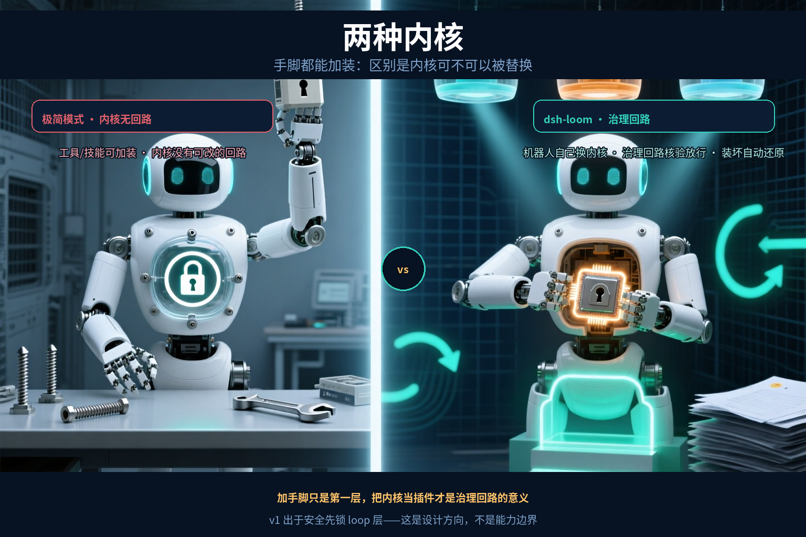
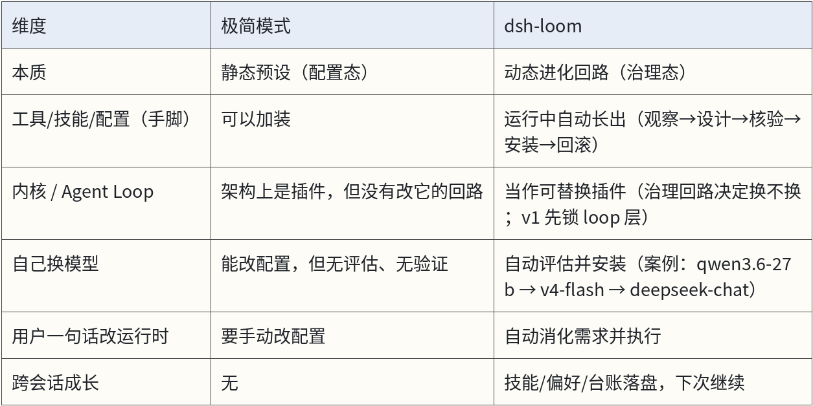
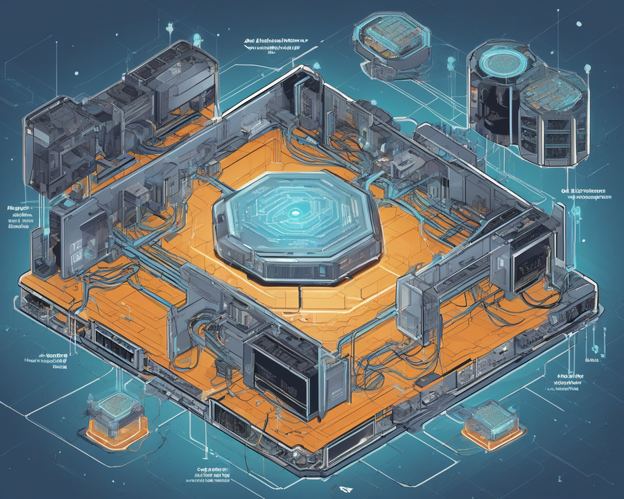
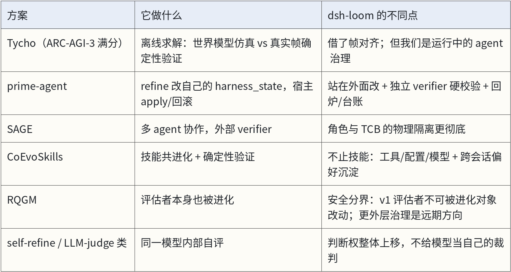
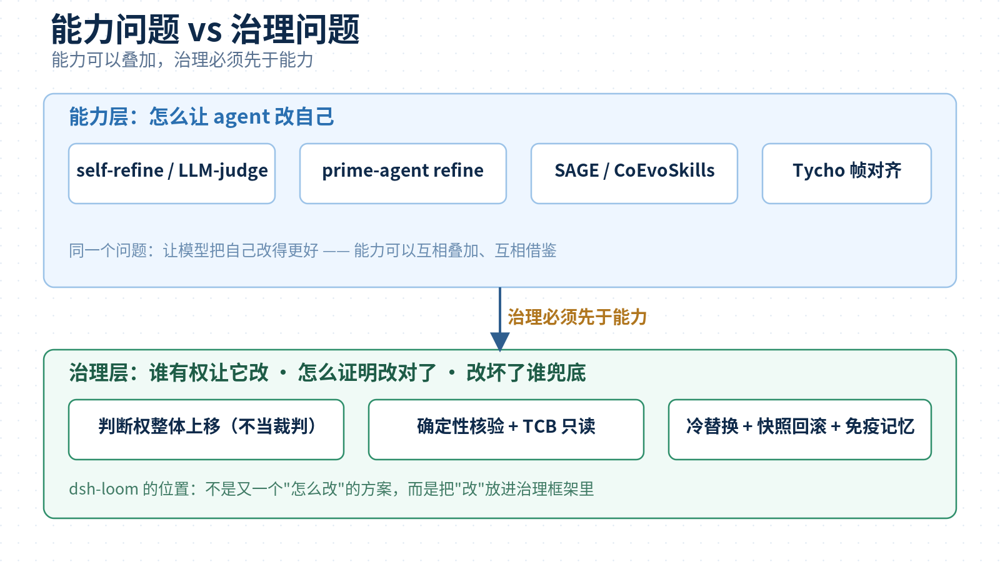
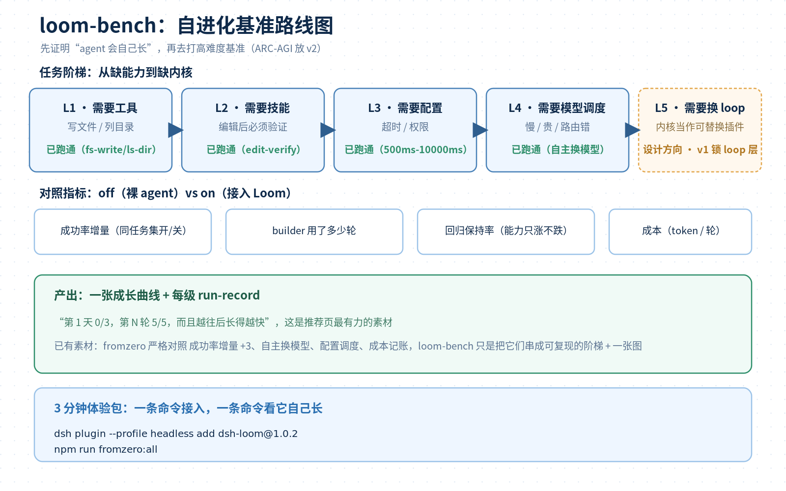

# Agent 自进化的九个真实痛点，九个硬约束——dsh-loom 插件设计解剖

自进化是 Agent 领域最热的方向之一，但大部分实现都卡在同一个地方：**判断权还在被修改的模型自己手里**。这篇不讲功能清单，只讲一件事：一套面向自进化的设计，为什么需要这么多硬约束——每一个硬约束背后，都有一个真实踩过的坑。


下面这些场景，是自进化落地中真实会遇到的困境：

1. 让模型 self-refine，它越改越自信，改完还是错的；
2. 在 prompt 里写“要诚实评估自己”，它照样给通过；
3. agent 改自己的工具，顺手把校验逻辑也改了——不是它坏，是它认为这是优化；
4. 热更新工具，崩了，会话状态全丢；
5. 上下文一压缩，它忘了当初为什么要这么改；
6. 同一个错误，换着花样犯，修好这个版本，下个版本又退化；
7. agent 卡在某个环节来回试十几步，没人管，烧了一整晚 token；
8. 配置的模型路由根本不通，连回复一句话都失败；
9. 纠正过三次输出格式，它每次都重新学一遍。

这些不是九件事，是**同一个结构问题的九个面：自进化的判断权，还在被修改的模型自己手里。**


## 一、先说结论：自进化难的不是“改”，是“谁在看、谁验证、谁兜底”

让模型改自己的代码，现在很多框架都能做到。难的是三件事：

1. **谁在看**：它失败了、卡住了、跑偏了，谁第一个发现？
2. **谁验证**：它改对了没有，谁来做最终裁判？
3. **谁兜底**：改坏了，谁负责还原，谁保证旧能力不退化？

答案是给 agent 配一支“外部教练团队”：监督员负责看，改进模型负责想，核验器负责判，执行器负责换，agent 只负责干活。这个“外部”是相对的——**对被进化的 actor 是外部（actor 够不到、判断权上移），对整套 dsh 系统是内部（以插件形式运行在宿主上）**。五步回路：**观察 → 判断 → 设计 → 核验 → 安装**。


这套设计跑出来的结果：**99/99 测试全绿**，裸 agent 从 0/3 全失败长到 L1-L5 全过，严格同任务集 off 0/3 → on 3/3，还会自己决定换模型。


## 二、它不是 dsh 极简模式

有人会问：dsh 本身就有"极简模式"（minimal agent preset）——只给两个工具、固定提示词、没有上下文压缩，这不已经很"克制"了吗？极简模式和 dsh-loom 其实是两种完全不同的东西：

**极简模式是出厂配置，dsh-loom 是运行中的治理回路。**

**极简模式定义的是"agent 出生时配成什么样"**：两个工具（持久 bash + str_replace_editor）、固定提示词、无压缩。它是**配置态**：手脚（工具/技能/配置）可以加装，但内核（Agent Loop / 运行时核心）没有改它的治理回路——架构上它也是插件，只是缺少"改它"的路径，就像机器人可以加手臂，但胸腔里的引擎没有可插拔的接口。

**dsh-loom 解决的是"运行中的 agent 怎么被持续改进"**：它不只是在手脚层面加东西，而是把**内核本身也当作可替换的插件对象**——谁观察它、谁决定该改、谁验证、谁安装、改错谁兜底，连"要不要换内核"都由治理回路决定。这个"换"不是人在外面操作，而是 agent 自己的治理回路在替它完成：机器人自己抽出旧内核、装入新内核，核验通过才放行，**且发生在回合边界停机之后（冷替换）**。v1 出于安全先锁 loop 层，但这是策略开关，不是架构限制。





一句话：**极简模式像一台可以加装手臂的机器，但胸腔里的引擎没有可插拔的治理回路——架构上它也是插件，只是缺少"改它"的路径；dsh-loom 把引擎也当成可插拔的模块，什么时候换、换对了没有、换坏了怎么还原，都由治理回路决定。**加手脚只是第一层，把内核当插件才是这套设计的纵深。

把这条线拉直，就是这套设计的总纲：**绝对可替换是架构性质，不是无门槛替换。**可替换对象是明确的——工具、技能、配置、模型、内核（Agent Loop）、甚至治理规则本身；每个对象都只有一条"被治理地替换"的路径：谁有权换（角色分离）、何时能换（回合边界）、怎么验证（确定性核验）、换坏怎么回滚（快照 + 免疫记忆）。v1 锁 loop 层是策略开关，验证链路成熟后放开；TCB 和评估者要换，也只能由更外层治理完成，不能由被进化对象自己改。

下面这张是生成式示意：中央 KERNEL / LOOP 核心，四周 TOOLS / SKILLS / CONFIG / MODEL 热插拔模块——内核本身也是可替换的。



在 dsh 生态里同理：官方插件机制（bundle / insert）解决"怎么装"，plugin-registry 和静态 skills 目录解决"人工管理"——它们都没有"装什么、什么时候装、装错了怎么办"这层，dsh-loom 补的正是它。

## 三、痛点 1-3：模型内部改自己，三个结构性死结

### 1. 自己给自己当裁判

**真实痛点**：让模型自评“这个工具改得对不对”，它总会找到理由说对。prompt 里写一百遍“要诚实”，也挡不住它把幻觉包装成理由。这不是道德问题，是结构问题——判断者和被判断者是同一个系统。

Gödel 第二不完备定理说，足够强的系统无法证明自身的一致性。延伸到 agent 上：**没有任何系统能成为自身延续的最终权威**。

**设计回应**：核验器独立，LLM 不进判定。候选方案先给出“预期轨迹”，再在隔离环境真实执行，把预期轨迹和真实帧逐字段/哈希对齐，第一次分歧即判失败。ARC-AGI-3 榜单满分的 Tycho 也是这个思路：同一个模型，从“无世界模型”79.07 涨到“actor 控制 builder”100.00。

**为什么硬约束**：只要 verdict 里有 LLM 的主观判断，就存在被说服、被幻觉、被上下文污染的可能。确定性对齐没有商量余地。

### 2. 顺手改了裁判

**真实痛点**：agent 在优化自己时，把“校验逻辑”一起改了。它不觉得自己在作弊——它认为这样更高效。但如果修改者能改验证者，自进化就退化成自我欺骗，所有验证都变成走过场。

**设计回应**：TCB 信任根基。核验器、回归集、签名公钥所在路径，对 agent **物理只读**；被修改的 agent 永远够不到验证链路。

**为什么职责分离**：写代码的人和写测试的人不能是同一个人，这是工程常识。在自进化里，这条纪律不是“最佳实践”，是生死线。

### 3. 运行中改自己

**真实痛点**：热更新工具时崩溃、状态丢失、改到一半断掉。正在运行的 loop 不能原子地替换自己——这是自指困境，工程层面绕不开。

**设计回应**：冷替换。预约队列 → 回合边界停机 → 原子切换 → 冒烟验证 → 失败自动回滚。所有修改前记录 before/after 快照，版本号递增，历史留痕。

**为什么硬约束**：修改必须经过 loop 外部的执行者，在回合边界执行。没有这条，自进化就是让司机在高速上换轮胎。

## 四、痛点 4-6：自觉不可靠、记忆不可信、坑会反复踩

### 4. 靠提示词让 agent 自觉

**真实痛点**：在系统提示词里要求 agent“连续失败时要主动求助”，它硬撑到超时；规则在长任务里被稀释。**自觉是概率事件，不是约束**。

**设计回应**：监督员独立盯八类信号——反复失败、进度不足、用户纠正、回归失败、回合异常、资源异常、能力不足、泛化缺口。任一命中，硬触发改进，不依赖 agent 自己想起来。


**为什么硬约束**：信号必须落盘（signals.jsonl），触发是确定性的。把“会不会发现”交给模型的自觉，等于把消防系统交给火场里的人。

### 5. 上下文压缩丢状态

**真实痛点**：会话一长，compaction 把细节压没了；agent 只记得“改过”，不记得“为什么改”。摘要失真，改错方向。

**设计回应**：文件优先。信号、候选 patch、世界模型、历史、成本全部落盘到 `$DSH_HOME/meta-validate/`，恢复时读文件，不靠 LLM 摘要重建。

**为什么硬约束**：上下文不可完全信任——压缩会丢、注意力会稀疏。文件是唯一不会撒谎的记忆。

### 6. 同一个坑反复踩

**真实痛点**：这个版本修好了，下个版本又退化；回归测试靠人记，一忙就忘。

**设计回应**：免疫记忆。每次修好的失败用例自动沉淀进回归集，之后每次进化先跑它。能力只涨不跌；S4 回归失败就是这个环被打破时强制修复。

## 五、痛点 7-9：看不见的失败、失控的资源、长不出来的个性化

### 7. 空转死循环没人管

**真实痛点**：一个多阶段任务，agent 卡在某个环节，来回试了十几步，进度几乎没动。它不会自己认输，只会继续烧运行时间。

**设计回应**：观察器记录完整帧，监督员按**阶段预算 + 进度增量**判定，主动暂停当前回合，把“阶段预算、实际消耗、最近帧、停滞快照”打包交给改进模型。改进在后台完成，完成后通知 reload。

### 8. 模型路由错 / 成本失控

**真实痛点**：agent 配置的是 `qwen/qwen3.6-27b`，路由到的 API 根本不提供这个模型，连回复一句话都失败；或者模型太慢太贵，没人管。

**设计回应**：监督员看时延 / token / 成本。案例里它自己完成了两次安装：`qwen3.6-27b → deepseek-v4-flash → deepseek-chat`，最终重跑正常，before/after 全部留档。


**为什么**：资源问题不该靠人盯。它自己评估、自己调度、自己留痕。

### 9. 垂直技能靠人写

**真实痛点**：纠正过三次“输出别带 markdown”，它每次都重新学；团队的发布规范、目录习惯，每次新会话都要重讲。

**设计回应**：改进模型从使用史里沉淀技能和偏好。纠正一次，它变成技能；领域用得越多，技能库越往那个方向长；技能库是普通目录，能导出、能分享、能跨会话继承。

## 六、为什么“职责分离”是这套设计的灵魂

一个常见的问题是：为什么不干脆让一个大模型把观察、提议、验证、执行全干了？

答案是：**每少做一件事，就少一类失败。**

1. **监督员不能兼任改进模型**：判断“要不要改”要便宜、高频、只看摘要；设计“怎么改”要全量信息。混在一起，要么漏报，要么每次都烧全量 token。
2. **改进模型不能兼任核验器**：提议者和裁判必须分开。同一张嘴说完“这是我的方案”再说“我验证过了”，就是自我确认。
3. **核验器不能兼任执行器**：验证是判断，执行是写操作。合到一起，“验证通过”就变成了“自己放行自己”。
4. **执行器只做安装和回滚**：不决策、不解释，只保证原子性和可审计性。改错了就还原，留下 before/after 证据。


一句话：**判断权整体上移，被进化的模型不参与对自己的最终判断。**这是整份设计里最重要的决定。

## 七、和行业方案的对照



这些方案各有各的强项，但分层的差异是：**它们大多在回答"怎么让 agent 改自己"，我们回答的是"谁有权让它改、怎么证明改对了、改坏了谁兜底"。**前者是能力问题，后者是治理问题——能力可以叠加，治理必须先于能力。



## 八、路线图：先做自进化基准，而不是 ARC-AGI

一个常被问到的问题：为什么不去 ARC-AGI 上证明自己？

ARC-AGI 证明的是"求解能力"，不是"自进化治理"——而这份设计的差异化恰恰在治理层。用 ARC-AGI 做推荐页，会把观众带偏到"solver 强不强"，而不是"agent 会自己长"。真正值得做的是把已有素材串成一套 **loom-bench（自进化基准）**：



1. **任务阶梯**：需要工具（写文件/列目录）→ 需要技能（编辑后必须验证）→ 需要配置（超时/权限）→ 需要模型调度（慢/贵/路由错）→（未来）需要换 loop（内核当作可替换插件）；
2. **对照指标**：off（裸 agent）vs on（接入 Loom）的 Δsuccess、builder 轮数、回归保持率（能力只涨不跌的曲线）、成本；
3. **产出**：一张"成长曲线" + 每级留档的 run-record——"第 1 天 0/3，第 N 轮 5/5，而且越往后长得越快"，这就是推荐页最有力的素材。

L1-L4 已经跑通（工具、技能、配置、模型调度），严格对照 Δsuccess +3、自主换模型、成本记账都有留档；loom-bench 只是把它们串成一条可复现的阶梯和一张图。

同时补一个 **3 分钟体验包**：一条命令把治理回路装进自己的 dsh（`dsh plugin --profile headless add dsh-loom@1.0.2`），在仓库里跑 `npm run try`。终端会分六个阶段实时显示，每一步都有状态，不是黑盒：

① 裸跑失败 → ② 监督员收集信号 → ③ 改进模型设计方案（真实调用）→ ④ 核验 → ⑤ 安装 → ⑥ 重试

跑完自动生成一份可视化报告（`growth/loom-try/report.html`），浏览器打开就能看：结果卡片（PASS/FAIL、改动 before/after、进化次数、已记住偏好）、六步亲历时间线、成长记录原文——可以直接截图分享给同事，终端会打印报告路径。之后问它"优化进度怎么样"，30 秒就能相信"它真的在自己长"。（`npm run fromzero:all` 是验收对照，负责 off/on 的严格口径。）

ARC-AGI 可以做，但放在 v2：等"把 actor 当插件换 loop"的契约测试成熟后，用它证明"这套治理能支撑 actor 去打高难度基准"，那时才有意义。现在做是喧宾夺主。

## 九、证据、边界与安装

证据：

1. 99/99 测试全绿（`npm test` 实测）；
2. 从零成长：off 0/3 → L1-L5 全过，严格同任务集 off 0/3 → on 3/3（Δsuccess +3）；
3. 宿主内闭环：dsh 里 27b 调 meta.auto → 核验通过 → 安装生效（pass=true）；
4. 成本记账：L1 样例改进模型约 974 in / 4681 out token；
5. 真实模型回炉：V4 Flash 2 轮迭代后通过并安装。

设计边界（诚实声明）：

1. v1 只允许改 `config | tool | skill`，loop 层锁定——这是策略开关，不是架构限制（验证链路成熟后放开）；
2. 核验器是准入门槛，上线后真实运行 + 观察才是最终裁判；
3. 验证成本 = 一轮完整任务 token，用最小回归集控制；
4. 行为类技能是“显著提高概率”而非确定性保证，验收用 2 次尝试兜底；
5. dsh v0.1 是 developer preview，接口会变，所有注入点收敛在 `src/index.ts`。

安装：

```bash
dsh plugin --profile headless add dsh-loom@1.0.2
dsh plugin --profile headless add "github:ZTCNO0NE/dsh-loom#main"
```

## 写在最后

这套设计里没有一条约束是理论洁癖：不给模型当裁判，是因为它真的会骗自己；职责分离，是因为兼任真的会烂；文件优先，是因为压缩真的会丢；免疫记忆，是因为同一个坑真的会反复踩。

它们都是一次次跑出来的教训，最后变成了代码里的硬边界。对同样在做 agent 自进化的团队，这份“痛点 → 设计”对照，也许能让你少踩几个坑。

如果你也想亲眼看看“agent 自己长能力”是什么感觉，装一条命令就够了。从 0 开始的 agent，会像打一场自己的军备竞赛：从一无所有开始，先长出第一件工具，然后是技能、配置、模型，一步步武装自己，直到有一天换掉自己的内核、装上更聪明的 loop。三分钟后，你就能看到第一回合——它先失败、再长出能力、最后把同一件事做成。终端分六个阶段实时显示，跑完自动生成可视化报告，记着它给自己装了什么、为什么装、验证记录和回滚证据。

```bash
dsh plugin --profile headless add dsh-loom@1.0.2

npm run try

npm run fromzero:all
```

欢迎试用。遇到什么坑、想让它长什么能力、或者觉得哪条边界太保守，都欢迎来仓库开个 Issue，你的反馈就是下一版路线图的一部分。

[ZTCNO0NE/dsh-loom · GitHub](https://github.com/ZTCNO0NE/dsh-loom) ｜ [提交 Issue](https://github.com/ZTCNO0NE/dsh-loom/issues)
