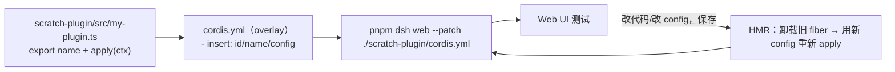
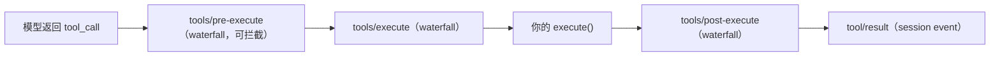

# DeepSeek Harness 插件开发流程（2026-08-15 整理）

依据官方 `docs/user/develop/basic/`（index/config/publish）与 cookbook（adding-a-tool）整理。流程分五段：环境 -> 本地开发循环 -> 打包 -> 安装校验 -> 分发。

## 1. 环境准备（一次性）

```bash
git clone https://github.com/deepseek-ai/deepseek-harness.git
cd deepseek-harness
pnpm install
echo "DEEPSEEK_API_KEY=sk-xxx" > .env
pnpm dsh web        # 打开 http://127.0.0.1:3080，验证环境正常
```

要求：Node ^22.19 或 >=24，pnpm。

插件本质：一个导出 `apply(ctx)` 的 TypeScript 模块。框架加载时调用 `apply` 传入 `ctx`，通过 `ctx` 注册的一切在插件卸载时自动清理。

## 2. 本地开发循环（核心工作流）

在源码 checkout 里建 `scratch-plugin/`，用 `--patch` overlay 挂载，靠 HMR 边改边看。



最小插件：

```ts
import type { Context } from '@deepseek-ai/cordis'

export const name = 'hello-plugin'

export function apply(ctx: Context) {
  // 在这里注册能力
}
```

overlay（插件路径必须绝对路径，patch 不改变 loader 的模块解析基目录）：

```yaml
# scratch-plugin/cordis.yml
- insert:
    - id: hello
      name: '/absolute/path/to/deepseek-harness/scratch-plugin/src/my-plugin.ts'
```

## 3. 插件能注册什么

### 3.1 工具（tool）

```ts
import type { Context } from '@deepseek-ai/cordis'
import { defineTool } from '@deepseek-ai/dsh-tools'

export const name = 'greet-tool'
export const inject = ['tools']

export function apply(ctx: Context) {
  ctx.tools.register(defineTool({
    name: 'greet',
    description: 'Greet someone by name.',
    parameters: {
      name: { type: 'string', required: true, description: 'The name to greet' },
    },
    output: {
      schema: { type: 'string' },
      render: (_args, value) => [{ type: 'text', text: value }],
    },
    async execute(args) {
      return `Hello, ${args.name}!`
    },
  }))
}
```

`defineTool` 字段：

| 字段 | 作用 |
|---|---|
| name | 模型可见的工具名（64 字符内，`[A-Za-z0-9_-]`） |
| description | 模型用来决定是否调用的描述 |
| parameters | JSON Schema，自动推导 args 类型并运行时校验 |
| output.schema | 规范值的 schema 声明 |
| output.render | 将规范值转换为模型可见的 ContentBlock |
| execute | 实际执行逻辑，接收校验后的 args + ToolExecution context |

工具执行管道（所有工具统一经过，权限/审批/超时/日志在这里生效）：



### 3.2 配置（Config + Schemastery schema）

```ts
import type { Context } from '@deepseek-ai/cordis'
import Schema from '@deepseek-ai/schemastery'

export interface Config {
  greeting: string
  maxRetries: number
}

export const Config: Schema<Config> = Schema.object({
  greeting: Schema.string().default('Hello'),
  maxRetries: Schema.number().default(3),
})

export function apply(ctx: Context, config: Config) {
  // config 已校验、已填默认值
}
```

设计原则：

- 无硬编码可调参数。检验标准：`cordis.yml` 能否不改代码改变这个值。
- 配置错误要响亮：schema 在加载时校验，非法配置让插件加载失败（fiber -> FAILED），而非运行时静默异常。
- 不要导出普通对象作为 `Config`，它不满足 Standard Schema 接口。

### 3.3 外部资源清理（ctx.effect）

```ts
ctx.effect(() => {
  const timer = setInterval(() => {}, 5000)
  return () => clearInterval(timer)
})
```

返回函数在以下场景自动执行：插件被 dispose、依赖服务消失（provider 热替换）、HMR 配置变更、应用关闭。

### 3.4 事件与拦截

```ts
export function apply(ctx: Context) {
  // 监听（不影响流程）
  ctx.on('tools/post-execute', (toolName, result) => {})

  // 链式拦截（必须调 next()，否则短路整个链）
  ctx.waterfall('tools/pre-execute', async (toolName, args, next) => {
    return next()
  })
}
```

事件三种：emit（广播）、serial（按注册顺序）、waterfall（链式，可拦截改写）。

### 3.5 服务（class 形态，供其他插件注入）

```ts
import { Service, type Context } from '@deepseek-ai/cordis'

declare module '@deepseek-ai/cordis' {
  interface Context {
    myService: MyService
  }
}

export default class MyService extends Service {
  static inject = ['tools']

  constructor(ctx: Context) {
    super(ctx, 'myService')
  }

  doSomething() {}
}
```

其他插件 `inject: ['myService']` 即可使用。类形式让插件成为依赖；函数形式适合大多数场景。

### 3.6 服务隔离（plugin-group）

同一个服务可以有多个实例，不同插件组看到不同实例：

```yaml
- id: coding-agent
  name: '@deepseek-ai/cordis-plugin-group'
  group: true
  isolate:
    shell: true
  config:
    - name: '@deepseek-ai/dsh-bash-local'
      config:
        timeoutMs: 5000
    - name: './my-strict-tool.ts'
```

适用于 tools、shell、fs、llm 等任何服务。我们的 validator 隔离执行可以借助它：验证任务跑在独立 group，不污染生产组。

## 4. 打包成 bundle

```
hello-plugin/
├── package.json       # 声明 "dsh": { "bundle": { "patch": "./cordis.patch.yml" } }
├── cordis.patch.yml   # 配置层：- insert: [{ id: hello, name: dsh-hello-plugin }]
└── index.js           # 插件入口
```

package.json 关键部分：

```json
{
  "name": "dsh-hello-plugin",
  "version": "0.1.0",
  "type": "module",
  "main": "index.js",
  "files": ["index.js", "cordis.patch.yml"],
  "dsh": { "bundle": { "patch": "./cordis.patch.yml" } }
}
```

cordis.patch.yml 里用**包名**（`name: dsh-hello-plugin`），Node 在已安装依赖里解析；本地开发 overlay 用文件路径。没有 `dsh.bundle` 声明的包也能装，但只作为普通依赖，不激活层。

## 5. 安装到 profile 并校验

```bash
dsh plugin --profile demo add ./hello-plugin   # 首次自动初始化 profile + @deepseek-ai/dsh-base
dsh --profile demo --dump-config               # 看合并后的插件树，确认你的层出现
dsh --profile demo                             # 启动实测
dsh plugin --profile demo remove hello-plugin  # 移除（同时删依赖和层）
```

加载顺序（后应用的层按行胜出）：

1. profile 的 `dsh.profile.bundles` 列表（按顺序，`@deepseek-ai/dsh-base` 最先）
2. profile 自己的 `cordis.patch.yml`
3. `$DSH_HOME/cordis.patch.yml`（机器级）
4. 命令行 `--patch` overlay（按 argv 顺序）

两个后果：

- patch 按行覆盖，**整行 config 整体替换、不深度合并**——patch 要重述整行需要的所有键。
- 用户可以在自己的 profile patch 里覆盖你的行，所以配置默认值要选用户大概率保留的。

## 6. 分发方式

| 方式 | 命令 | 注意 |
|---|---|---|
| npm | `dsh plugin add your-package` | 预构建，最简单 |
| tarball | `dsh plugin add ./pkg-0.1.0.tgz` | `pnpm pack` |
| GitHub | `dsh plugin add github:you/repo#sha` | 要 `prepare` 脚本构建 + pnpm allowBuilds 允许；pin commit |
| 本地 | `dsh plugin add ./local-dir` | pnpm link，开发用 |

GitHub 安装细节：git 安装取源码不是产物，`prepare` 脚本要在安装时自包含构建（不能依赖 monorepo 上下文）；pnpm >=10 默认拒绝运行 git 依赖的 `prepare`，需把 pnpm 打印的包 key 加入 profile 的 `pnpm-workspace.yaml:allowBuilds`，首次 add 会失败并提示。

## 7. 调试技巧

- `pnpm dsh web --dump-config`：打印所有层合并后的完整插件树。
- 插件里 `console.log('Available services:', Object.keys(ctx.root))`：检查服务注册。
- HMR 循环：启动后改 `scratch-plugin/src/*.ts`，保存观察终端里"旧插件卸载 + 新插件加载"，Web UI 立即可用，不用重启进程。

## 8. 映射到 dsh-meta-validate

| 设计组件 | dsh 机制 | 落地方式 |
|---|---|---|
| observer | 事件系统 | `ctx.on('tool/result' / session 事件)` 采集失败信号 |
| proposer | 工具 + 独立 LLM 调用 | `meta.propose` 工具，模型只能预约 |
| validator | 对齐式验证（Tycho）+ 服务隔离 + 临时 profile | 候选 patch 自带预期轨迹；独立 group 跑回归集，仿真预测与真实轨迹逐字段/哈希完全对齐，第一分歧判 needs_changes；`dsh --profile <scratch> --dump-config` 校验组合树后冒烟 |
| gate | patch 层 + 回滚 | 应用 = 整行 config 替换 + before/after 快照 + 失败回滚；版本递增留痕 |
| 工具面 | `defineTool` + schema | `meta.propose` / `meta.validate` / `meta.apply`，parameters 用 schema 约束 targetId/kind/config |

开发环境注意：cordis 类型要链接到 dsh 源码 checkout 的构建产物（`packages/<pkg>/lib/types`），不要链运行实例的 staging 目录——staging 快照可能是旧构建。
