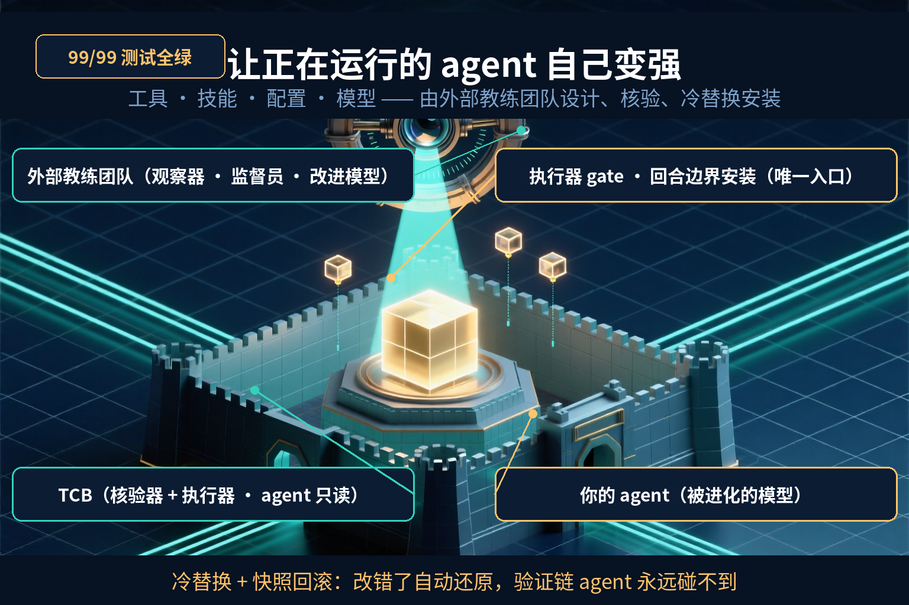
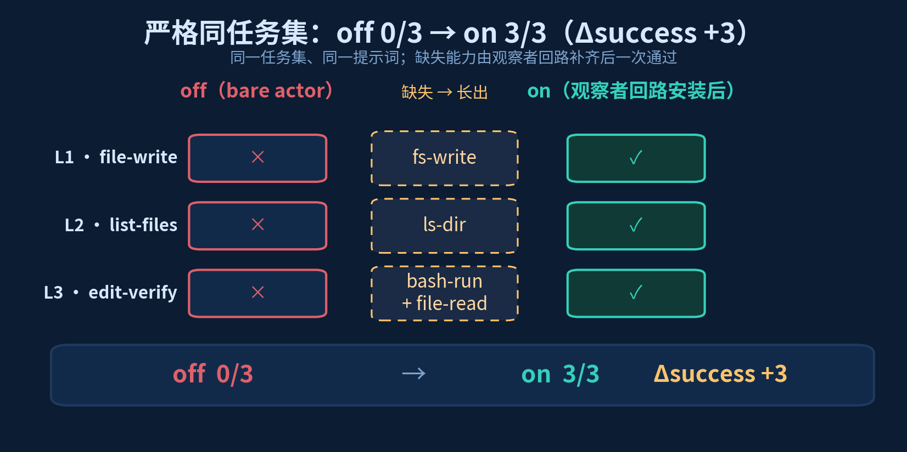
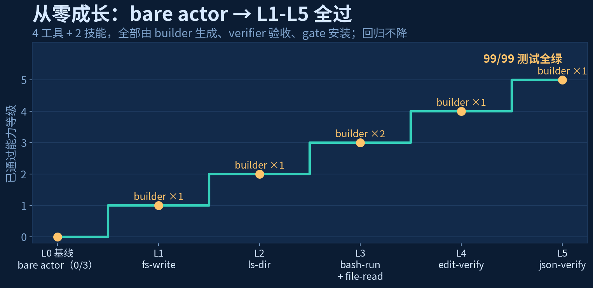
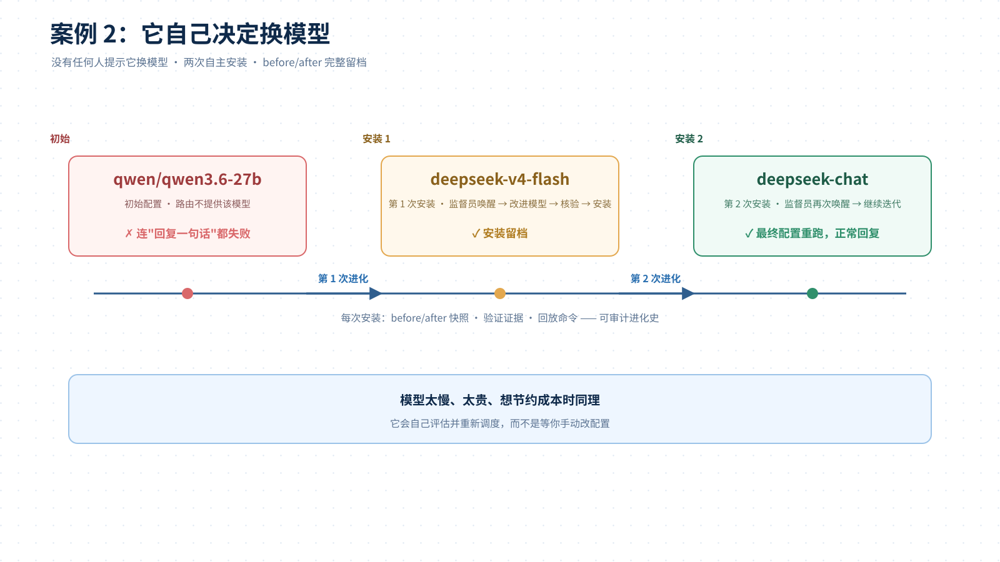
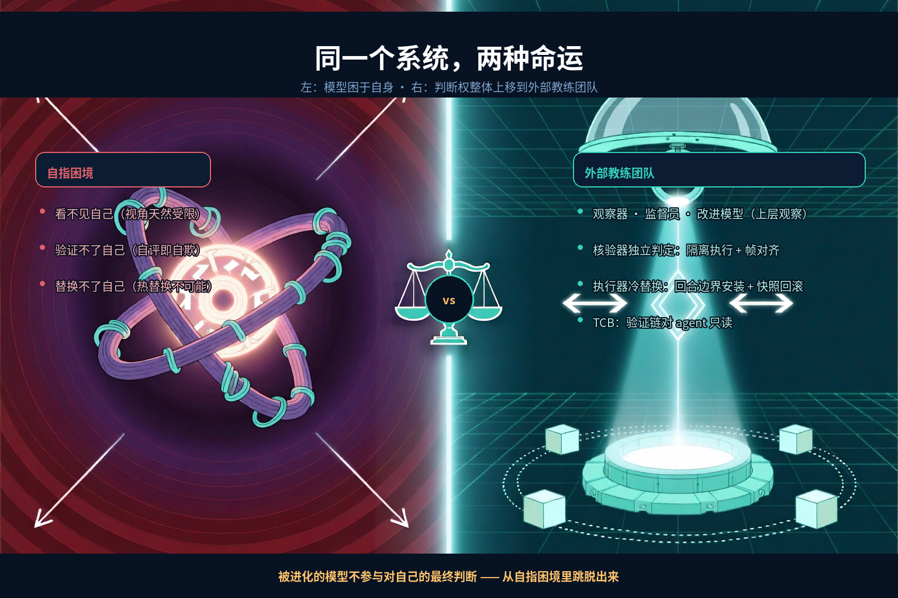
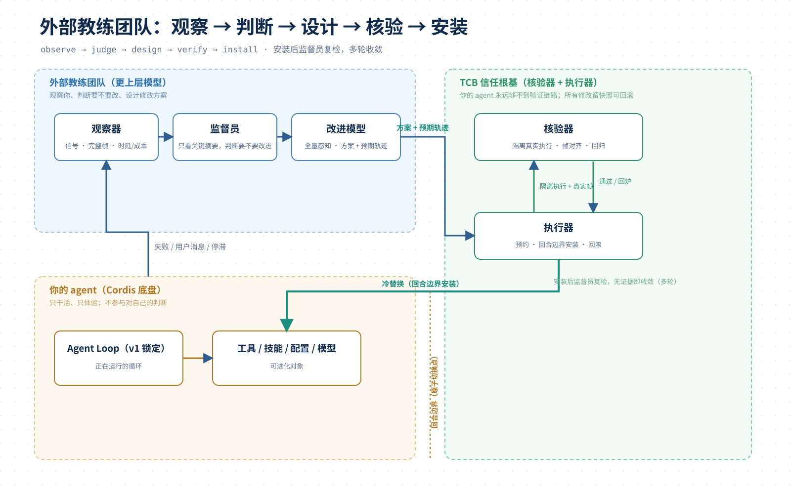
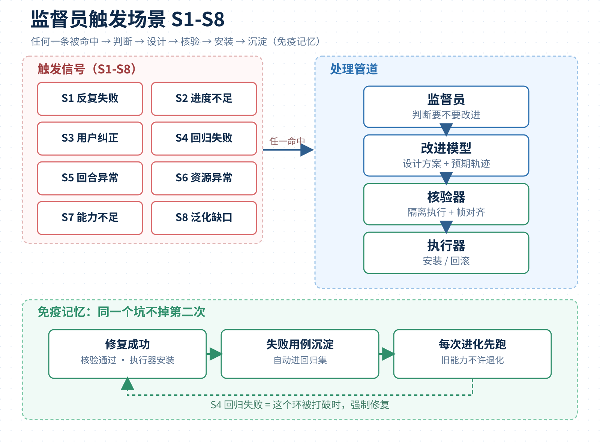

# AI Agent 无法自己进化自己——我给它配了一支“外部教练团队”

DeepSeek Harness 开源不到一周，GitHub 星标逼近 4 万，700+ 个插件冒出来：记忆、UI、小游戏、Claude 搬家，什么都有。但没人回答一个问题：**插件从哪来？agent 怎么长出自己没有的能力？**

先看一个常识：人不能揪着自己的头发把自己提起来；运动员不能既当运动员又当裁判；正在运行的程序，不能原子地修改正在运行的自己。模型也一样，它被困在自己的循环里，看不见自己缺什么，验证不了自己改得对不对，替换不了正在运行的自己。

所以进化必须来自一个外部观察者。我给 DeepSeek Harness 写了一个插件 `dsh-loom`（对外品牌 **Loom · 织机**——把你的使用、纠正与失败“织”进 agent 的能力里），相当于**给你的 agent 配了一支“外部教练团队”**：监督员看着它干活，改进模型负责设计方案，核验器独立把关，执行器冷替换安装。全程不需要你写代码。

它跑出来的结果：**99/99 测试全绿**，裸 agent 从 0/3 全失败长到 L1-L5 全过，严格同任务集 off 0/3 → on 3/3，还会自己决定换模型。



## 一、先看结果：一个什么都不会的 agent，怎么长出能力

### 1. 从零养大：off 0/3 → L1-L5 全过

我把一个本地 27B 模型接进 dsh，第一天它连“把内容写进文件”都做不到。不是模型笨，是它**根本没有写文件的工具**。

插件介入后，改进模型逐级生成并安装：`fs-write`、`ls-dir`、`bash-run`、`file-read` 四个工具，`edit-verify`、`json-verify` 两个行为技能。每一级都经过隔离真实执行 + 完整核验 + 安装，旧能力回归不降。





### 2. 它自己决定换模型

有个案例最能说明“不是套壳”：agent 配置的是 `qwen/qwen3.6-27b`，但路由到的官方 API 根本不提供这个模型，连回复一句话都失败。**没有任何人提示它换模型**。

监督员唤醒改进模型，它把默认模型改成 `deepseek-v4-flash`；安装后监督员再次被唤醒，它继续迭代，改成 `deepseek-chat`；重跑，正常回复。两次修改的 before/after 完整留档。



### 3. 你说一句话，它自动改运行时

你直接说：“bash 命令 sleep 1 总是 500ms 就被杀掉，把超时调大。”——没让 agent 调用任何特殊指令。插件自动消化这条消息，把超时从 500ms 调到 10000ms，核验通过、安装生效。

这条路线的意义：**即使你的 agent 完全不知道自己该求助，宿主也能兜底。**

## 二、问题：为什么模型无法自己进化自己

### 1. 看不见自己

agent 只有自己的上下文和轨迹，而这些全部由它自己产生。它不知道自己的工具缺什么、行为哪里错、loop 该怎么改。就像写代码的人从不 review 自己刚写的代码——不是不想，是视角天然受限。

### 2. 验证不了自己

让模型判断自己的修改是否正确，等于自己给自己当裁判，自我确认偏误会把错误变成“正确”。Gödel 第二不完备定理早就证明：**足够强的系统无法证明自身的一致性**。延伸成一句话：没有任何系统能成为自身延续的最终权威。

### 3. 替换不了自己

正在运行的 loop 不能原子地替换自己。任何改动都会打断正在执行的状态，改错了也没有外部兜底。

这不是我的猜想，前沿方案全是“外部硬校验 + 多角色协作”：ARC-AGI-3 榜单满分的 Tycho，同一个模型从“无世界模型”79.07 涨到“actor 控制 builder”100.00，差的就是独立构建和验证环节；SAGE 四个自进化 agent 协作，正确性由外部 verifier 判定；CoEvoSkills 的技能自进化，每个任务配确定性验证器，二元 pass/fail，无主观判断。



## 三、我的答案：外部教练团队

### 1. 五个角色，职责分开

- **监督员**：一直看着你的 agent 怎么干活，判断“该不该改进”；
- **改进模型**：看全量信息，设计具体修改方案（加工具、改技能、调配置、换模型）；
- **核验器**：把方案放进隔离环境真实跑一遍，和预期结果逐项核对，不通过就退回重做；
- **执行器**：只负责安装和回滚，改错了自动还原；
- **你的 agent**：什么都不用改，继续干活，然后发现自己越来越能干。

### 2. 一条五步回路

**观察 → 判断 → 设计 → 核验 → 安装**。修改永远发生在 loop 外部（冷替换），验证发生在 agent 够不到的地方（TCB 信任根基，对 agent 只读）。



### 3. 判断权整体上移

多数自进化是“模型提议、模型评审、模型决定”，终审还是模型自己。这里改进模型只负责提议，核验器独立判定，执行器负责安装——**你的 agent 不参与对自己修改的最终判断**。

核验是确定性的：预期轨迹和真实帧逐字段/哈希对齐，第一次分歧就退回重做，LLM 不进判定。

## 四、九个案例，一条回路

### 1. 触发场景 S1-S8

监督员不是等 agent 自己认输，而是主动盯八类信号：反复失败、进度不足、用户纠正、回归失败、回合异常、资源异常、能力不足、泛化缺口。任一命中，就走同一条回路。



### 2. 免疫记忆：同一个坑不掉第二次

修好的失败用例自动沉淀进回归集，之后每次进化先跑它。能力只涨不跌，S4 回归失败就是这个环被打破时强制修复。

### 3. 更多切面

新项目 onboarding、技能包导出分享、多 agent 共享技能库、危机恢复复盘、资源自适应、安全自适应、插件自举、可审计进化史——都是同一条回路的不同切面。

## 五、五分钟上手 + 诚实边界

### 1. 上手（三步）

```bash
npm install
npm run check
npm run build
dsh plugin --profile demo add ./dsh-loom
dsh --profile demo --dump-config
```

开一个开关（后台优化，不卡对话）：

```yaml
config:
  mode: apply
  scheduled: true
  notify:
    start: true
    progress: true
    completion: true
```

然后正常用：失败多了、卡住了、你纠正过它，它自己会变强；想知道进度，直接问它“优化进度怎么样？”；完成会告诉你“reload 后生效”。

改进模型 / 监督员默认走 DeepSeek V4 Flash；你的 agent 可以接本地模型（示例 qwen3.6-27b）。

想看它工作：`npm run fromzero:all`（从零养大）、`npm run supervisor-swap-demo`（自主换模型）、`npm run scheduled-notify-demo`（预约式后台优化），都是真实模型跑通并留档。

### 2. 边界

- v1 只允许改 `config | tool | skill`，loop 层锁定——这是设计项，不是缺陷；
- 核验器是准入门槛，上线后真实运行 + 观察才是最终裁判；
- 验证成本 = 一轮完整任务 token，用最小回归集控制；
- 行为类技能是“显著提高概率”而非确定性保证，验收用 2 次尝试兜底；
- dsh v0.1 是 developer preview，接口会变，所有注入点收敛在 `src/index.ts`。

## 写在最后

自进化这个方向，真正难的不是让模型写代码，而是**谁在验证、谁在执行、谁在兜底**。我的答案：改进模型负责想，核验器负责对，执行器负责换，agent 负责跑。修改者和核验者彻底分离，信任根基只读，冷替换加回滚。

项目仓库：[ZTCNO0NE/dsh-loom](https://github.com/ZTCNO0NE/dsh-loom)。

参考：
- [DeepSeek Harness](https://github.com/deepseek-ai/deepseek-harness)
- [Tycho（ARC-AGI-3）](https://github.com/NIMI-research/Tycho)
- [SAGE：多智能体自进化（arXiv 2603.15255）](https://huggingface.co/papers/2603.15255)
- [CoEvoSkills：技能自进化与共进化验证（arXiv 2604.01687）](https://arxiv.org/abs/2604.01687)
- [prime-agent](https://github.com/PrimeIntellect-ai/prime-agent)
