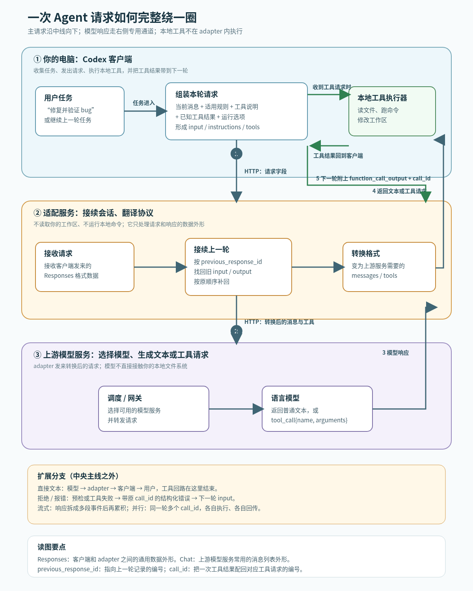
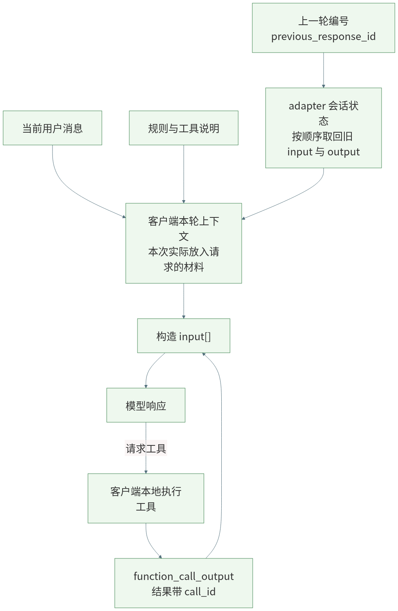
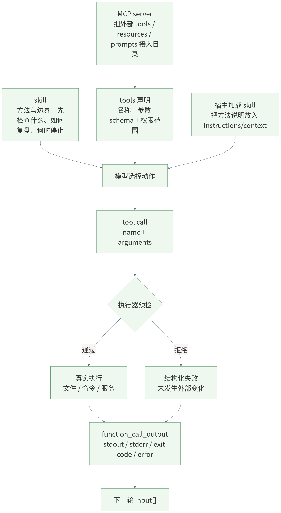
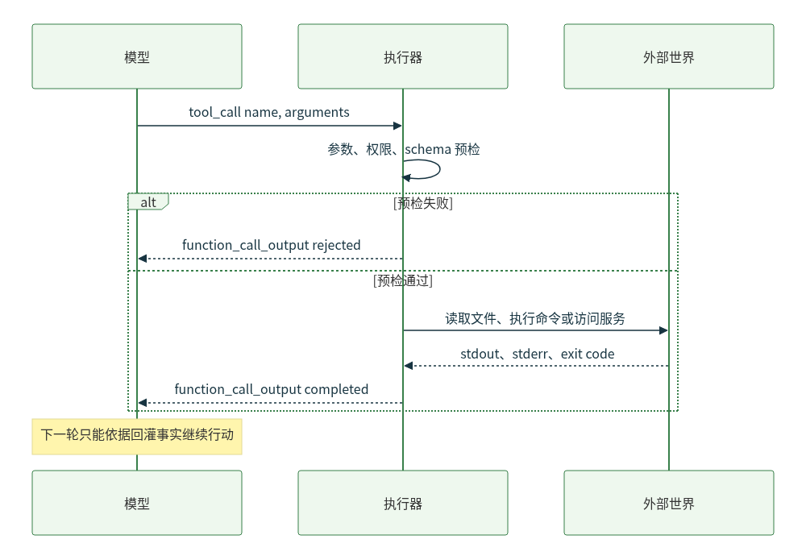
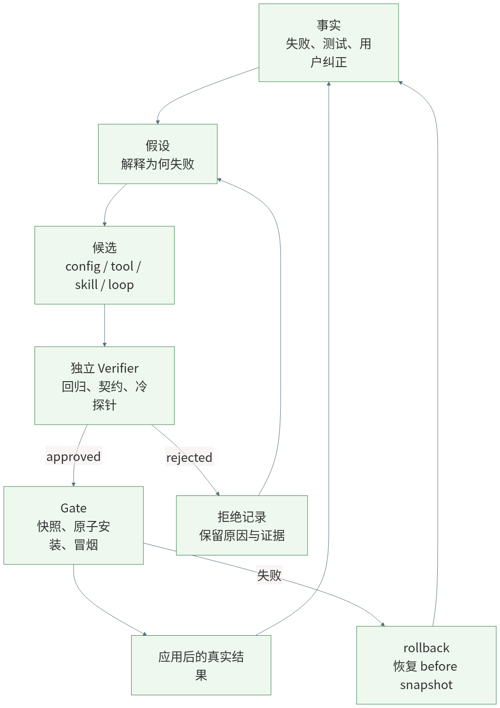

# 别把 Agent 神化：一次请求、一次工具调用与“自我进化”的真实边界

很多 Agent 的演示都从一句话开始：你说“修这个 bug”，它读文件、跑命令、改代码，再告诉你完成了。过程足够像一个会工作的同事，人很容易接着相信：它已经理解了项目，也许还能从失败里自己变强。

这两个判断之间，隔着不少工程部件。一次请求如何被组装？历史怎样进入本轮？skill、tool、MCP 各做什么？工具结果怎样回到模型？如果 Agent 要改自己的能力，谁来判断改动可信？把这些关系拆开，Agent 就不再像一个神秘黑箱。

本文以我本机核查过的 Codex 客户端与 adapter 链路作例子。不同客户端、服务端与模型的字段细节会不同；有一件事却很稳定：模型每一轮处理的都是一份被组装、更新和裁剪的工作包。


## 先看全链路：一句话怎样绕一圈回来



这张总览图从左到右读：用户在 Codex 客户端提出任务；客户端把当前消息、适用规则和允许调用的工具整理成 HTTP 请求，发送给 adapter。adapter 做两件事：如有上一轮编号就从自己的短期会话状态中补回旧的输入和输出；再把这份 Responses 格式的请求改写为上游模型服务接受的 Chat 格式。调度/网关选择模型，模型返回普通文本或“请调用某工具”的结构化请求。

如果模型请求工具，adapter 把请求原样包装回客户端；**客户端在用户电脑上执行本地工具**，例如读文件、跑命令或修改工作区。客户端将执行结果与原工具调用的 `call_id` 配对，作为 `function_call_output` 放进下一轮请求。adapter 不替客户端执行这些本地工具；它负责转发、状态接续和协议转换。

图中术语的白话定义：

- **HTTP 请求**：程序之间用网络发送的一包结构化数据；这里不是“模型思考内容”，而是客户端交给服务的字段集合。
- **Responses 格式**：客户端与 adapter 约定的请求/响应外形，能同时容纳文字、工具调用和工具结果。
- **Chat 格式**：许多上游模型服务使用的消息列表外形，adapter 将前一种外形转换为这种外形。
- **`previous_response_id`**：上一轮回答的编号。它是“从哪里接着找历史”的指针，不是知识库，也不代表模型已经记住或理解历史。
- **`call_id`**：一次工具请求的编号。客户端用它说明“这份结果属于刚才哪一次工具调用”，避免结果串线。

总图只把“单个本地工具调用”画成中央主线；以下是同一链路的扩展分支：模型直接返回文本时，响应从 adapter 回到客户端后就结束，不会进入工具执行；工具参数预检失败或工具本身报错时，错误也会被包装成结果，带着原 `call_id` 回到下一轮。adapter 在响应结束后保存本轮 input/output，下一轮再由 `previous_response_id` 或 `conversation` 找回。流式模式只是把模型响应拆成多段事件传输，客户端或 adapter 在工具调用结束前累积片段；并行模式则让同一轮出现多个 `call_id`，每个结果分别配对。

普通 Chat 兼容请求和非 Codex Responses 请求走 adapter 的兼容分支，不应被这张“原生 Codex 主链”误读为同一条协议。

## 一、用户消息只是工作包的一部分

### 1. context 不是一段聊天记录

#### ① 本轮工作包从多种来源拼出来

在我核查的本机链路中，当前任务以结构化 `input` 进入请求；稳定的 `instructions`、工具声明、推理设置和并行工具设置分开携带。用户消息只是输入源之一。

把任务交给一位新同事时，你不只会说“修 bug”。你还会给他项目规则、可用工具、上次做到哪里、刚刚一条命令返回了什么。少了规则，他可能越过边界；少了结果，他可能重复已经失败的尝试。

```text
当前任务 + 稳定规则 + 能力目录 + 相关状态 + 工具结果
                         = 本轮工作包
```


#### ② context 是工作台，memory 是材料库

**context** 是模型这一轮实际看得见的工作台。任务、最近对话、工具输出和被注入的规则都在这里，但它受预算和编排策略限制。

这里要严格分开两件常被都叫作“记忆”的机制。客户端上下文选择可以从项目文件、摘要、用户偏好或检索结果中挑材料；是否这样做由客户端/宿主决定。另一方面，我核查的 adapter 有一个会话状态存储：它按上一轮回答编号保存当时的 input 与 output，在下一轮把这串项目按顺序补回。后者是历史回放，不会自己按语义判断“哪段最相关”，更不等于模型学会了什么。



对应的伪代码是：

```text
history = adapter_state.expand(previous_response_id)
context = client.choose([user_message, project_rules, history])
request = {"input": context, "tools": allowed_tools}
response = adapter.forward_and_translate(request)
if response.requests_tool_call:
    result = client.local_executor.run(response.tool_call)
    request.input.append({"type": "function_call_output",
                          "call_id": response.tool_call.id,
                          "content": result})
```

这张图读法很简单：adapter 的状态存储负责“把以前发生的项目按顺序找回来”；客户端上下文负责“这次到底带哪些材料”。前者不做语义理解，后者才可能涉及筛选与预算。

最常见的误解是“有历史，所以已经学会”。历史只说明材料还在；没有筛选、来源和验证，一段旧摘要也可能只是反复注入的旧猜测。

### 2. input body 让不同材料各归其位

#### ① 请求体不是一段很长的 prompt

把所有机制都叫作 prompt 很省事，却抹掉了边界。`input` 更接近这一轮发生了什么；`instructions` 放稳定行为约束；`tools` 描述可调用能力及参数形状；推理和执行设置影响模型怎样使用这些能力。它们的职责和更新节奏不同。

一个便于理解的请求体可以写成下面这样。字段名是教学化的简化表示，不是对所有客户端 wire contract 的硬编码：

```json
{
  "instructions": "遵守项目规则；先读取 CURRENT.md；不要越过验证边界",
  "input": [
    {"role": "user", "content": "修复并验证 bug"},
    {"type": "context", "name": "相关项目规则", "content": "..."},
    {"type": "function_call_output", "call_id": "call_17", "content": "TypeError: run is not a function"}
  ],
  "tools": [
    {"type": "function", "name": "read_file", "parameters": {"path": "string"}},
    {"type": "function", "name": "run_command", "parameters": {"command": "string"}}
  ],
  "reasoning": {"effort": "medium"},
  "parallel_tool_calls": false,
  "previous_response_id": "resp_previous"
}
```

字段装配的伪代码：

```text
body.instructions = stable_rules
body.input = [user_message, context_items, previous_tool_outputs]
body.tools = expose_allowed_tools(tool_policy)
body.reasoning = runtime_options.reasoning
body.parallel_tool_calls = runtime_options.parallel
body.previous_response_id = session.previous_response_id
```

字段关系：`input` 描述本轮发生了什么；`instructions` 描述必须遵守什么；`tools` 描述允许请求哪些动作及其参数形状；`function_call_output` 是执行器回传的事实；`previous_response_id` 只负责接续状态，不能代替事实筛选。

#### ② 状态展开只负责接续

adapter 可以依据 `previous_response_id` 或会话链展开此前 input，再转换成上游模型需要的 body。**状态展开**解决“这轮怎样接上上一轮”，并不自动完成“什么是事实”“哪段仍相关”“一次成功如何变成长期规则”。

## 二、skill、tool、MCP 不在同一个位置




这里还要区分执行位置：本地文件和终端工具由客户端执行；MCP 接入的远端能力或 adapter 自己的服务侧桥接工具，可能在服务侧执行。`tools[]` 只描述“模型可以请求什么”，不单独决定“在哪台机器执行”。

把三者放进一次调用，可以写成：

```text
skill = load_skill("refine")
tool_catalog = mcp_server.list_tools() + host_tools
decision = model.plan(skill, tool_catalog, context)
call = decision.tool_call
if not schema.validate(call.arguments):
    return tool_result(status="rejected", reason="invalid arguments")
return executor.invoke(call.name, call.arguments)
```


### 1. skill 讲方法，tool 提供动作

#### ① skill 不会替模型执行命令

**skill** 更像可复用的操作手册：面对什么信号，先做哪些检查，哪些边界不能越过，结果如何报告。它影响模型怎样组织行动，但它自己不读文件、不改配置、不发请求。

#### ② tool 是受约束的外部接口

**tool** 才是模型伸向外部世界的接口卡。模型提出工具名和参数，执行器决定是否真的执行；成功、超时和异常输出再以结构化结果回到下一轮。**模型发出工具调用，不等于动作已经发生。**

### 2. MCP 是接入层，不是万能工具

#### ① 它负责把外部能力接入目录

**MCP** 可以把外部提供者的 tools、resources 或 prompts 接进能力目录。它像接驳总线，不负责替模型规划任务，也不等于某一个工具的执行结果。

这三者可以这样记：skill 告诉模型“通常怎样做”；tool 规定“允许做什么动作”；MCP 处理“怎样接入一批外部能力”。接上 MCP 不等于权限已经放开；写好 skill 也不能绕过 tool 的参数与权限边界。

## 三、工具调用为什么必须有回程



工具回程的伪代码：

```text
call = model.next_action()
check = preflight(call.name, call.arguments, policy, schema)
if not check.ok:
    output = {"status": "rejected", "reason": check.reason}
else:
    result = world.execute(call.name, call.arguments)
    output = {"status": "completed", "stdout": result.stdout,
              "stderr": result.stderr, "exit_code": result.exit_code}
return model.next_turn(input=[call, output])
```


一个响应结束后的状态保存可以简化为：

```text
response = adapter.finish(stream_or_non_stream_events)
state.save(
    response_id=response.id,
    input=current_input,
    output=response.output,
    previous_response_id=request.previous_response_id,
)
```

若一轮有多个工具调用，客户端不是按位置猜结果，而是按编号配对：

```text
for call in response.tool_calls:
    result = client.execute(call.name, call.arguments)
    next_input.append({
        "type": "function_call_output",
        "call_id": call.call_id,
        "content": result,
    })
```

### 1. 模型提出动作，执行器决定是否让动作发生

#### ① 预检失败时，外部世界没有变化

模型输出工具调用后，参数、兼容性和权限仍可被预检拒绝。此时应把“没有执行”的原因返回模型。预检能拦住确定性错误，却不能证明任务已经解决。

### 2. 结果回灌让下一轮能面对现实

#### ① 执行结果必须成为下一轮事实

预检通过后，执行器才真正访问文件、命令行或远端服务。结果不论成功还是失败，都应回灌为结构化输出。没有这条回程，模型只能继续猜；把结果压缩成一句“成功”，模型也很难定位下一步。

## 四、为什么 ReAct、记忆和 refine 还不等于自进化

### 1. 它们已经让 Agent 能把任务跑得更长

#### ① 单次任务里的适应很有价值

观察、行动、再观察的循环，让 Agent 能根据工具结果调整下一步。记忆能保留偏好和项目约定；规划、重试能处理更多失败路径。这些机制让 Agent 从一次性文本生成，变成能与外部环境往返的执行系统。

#### ② 轨迹不天然等于经验

一次 retry 成功可能是偶然；一段复盘写得通顺，也可能没有改变下一次行动。**轨迹**记录发生过什么，却不自动说明应该修改哪里、这条修改对哪些任务仍成立。


### 2. refine 把问题推进到工程变更

#### ① 候选更新需要治理

refine 类机制会在任务后读取轨迹，对提示词、记忆、skill 或运行状态提出小步修改。价值不在“又调用一次模型”，而在把临时反思变成候选更新。

候选不是结论。谁冻结修改前状态？谁验证？谁安装？失败后回到哪个版本？一旦改动涉及 skill、tool、配置、模型路由或 runtime，这些问题就比生成一段建议更重要。

#### ② 自评能探索，不能单独终审

同一个模型发现问题、提出改动、评价改动并决定上线，速度很快，风险也集中在同一处。模型自评可以提供方向，却不应独自拥有最终裁决权。

## 五、可信自进化先是一套可反驳的账本



自进化控制面的伪代码：

```text
fact = observe(actor_run)
hypothesis = builder.explain(fact)
candidate = builder.propose(hypothesis, target_before=snapshot())
report = verifier.check(candidate, regression_suite, contract)
if report.approved:
    gate.apply_atomically(candidate)
    if not smoke_test(candidate):
        gate.rollback()
else:
    ledger.record_rejection(candidate, report)
```

这里的关键不是“模型能不能提出修改”，而是候选是否经过独立验证、是否有安装前快照，以及失败后能否回到已知状态。

### 1. 分清事实、假设与候选

#### ① 失败首先只是观察

工具报错、测试失败、用户纠正和任务停滞都是**事实**，却不会自动说明怎么修。系统要把解释写成可被推翻的假设，再用最小测试或受控对照检验它。

#### ② 候选改动是一场受限实验

候选应说明修改范围、预期结果、验证入口与回滚对象。验证失败时，失败要能定位到这一次实验，而不是混进后续一连串操作。被拒绝的候选同样应留下来，成为下一轮的证据。

### 2. 可替换能力需要不可替换的边界

#### ① 学习不该只锁在 prompt 里

工具、skill、配置、模型路由和执行 runtime 都会改变 Agent 行为。不同失败需要不同修复入口：读不到文件可能缺工具，格式总错可能缺 skill，超时可能是配置问题。

#### ② 验证链必须保持独立

Verifier、Gate、回归集和权限边界构成信任根。正在被评估的候选可以被它们检查，却不能先改掉检查规则再宣布通过。

这也是 Loom 想补的控制面：把失败、假设、候选、独立验证、冷应用和回滚放到 Actor 外部。它目前不是通用世界模型，也没有证明任意 Agent 都能稳定改好复杂代码；局部 scheduler 实验更不能外推为整体性能。下一篇将只用 refine skill 冷加载/回滚和 scheduler 案例，逐条说明证据能支持什么。

## 写在最后

今天的 Agent 已经很会行动。让它可靠成长，难点却不只是模型更聪明，而是让一次行动留下能被检查、复跑、拒绝和撤回的状态。

自进化并不神秘：把失败保留为事实，把解释写成假设，把改动限制为候选，把通过权交给独立验证器。能力可以继续变，现实世界仍然保留最后的否决权。

扩展阅读：

- [Codex 开源客户端的请求组装](https://github.com/openai/codex/blob/main/codex-rs/core/src/client.rs)
- [Model Context Protocol](https://modelcontextprotocol.io/)
- [Loom 的实验记录与审计范围](https://github.com/ZTCNO0NE/dsh-loom/tree/main/docs/research)
